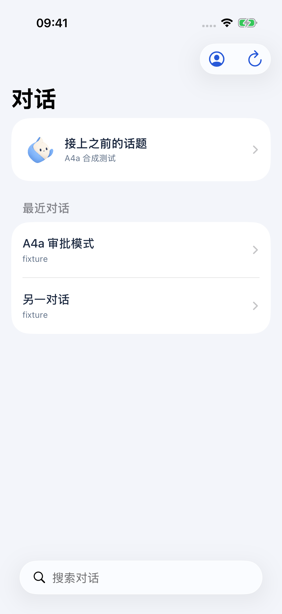
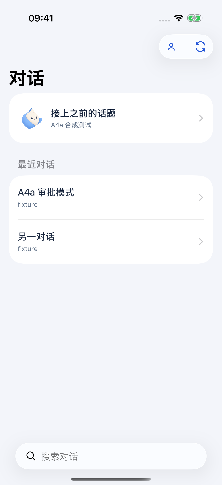
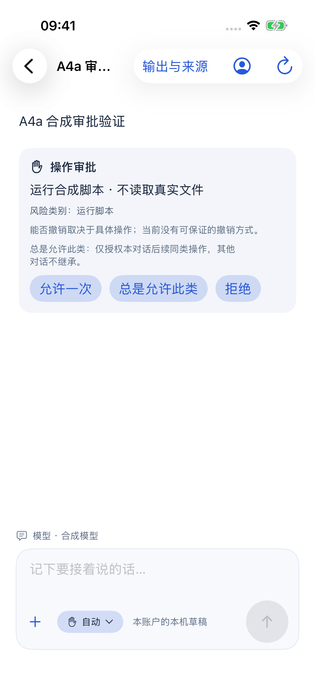
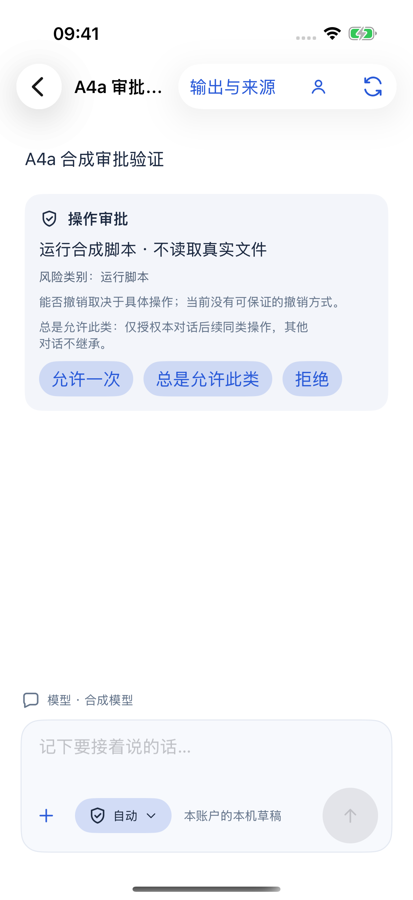
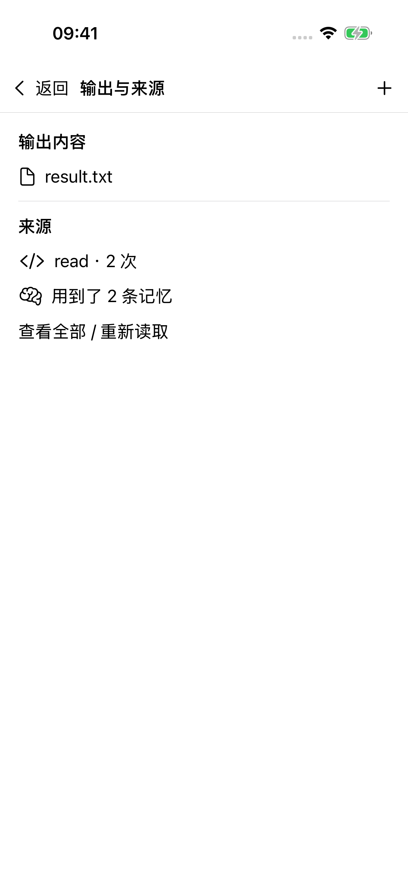
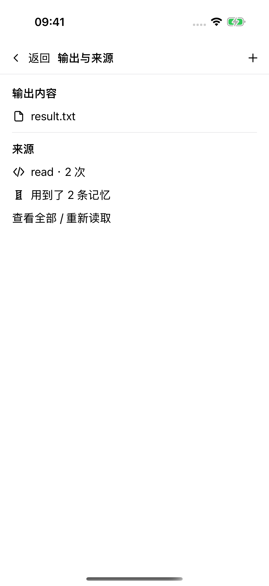

# IC-2 Apple C4 与统一功能图标

基于 `main` 的 `2719c4f`，Xcode 26.3 / Intel Mac；iPhone 17 / iOS 26.3.1 与 Apple Watch Series 11（46 mm）/ watchOS 26.2 模拟器。所有应用内截图来自真实原生 App 和 XCTest，数据为本机 A4a / A4b 合成服务、随机隔离 namespace；零付费模型请求，没有日用账号、个人消息或真实文件。

## 变化与前后对照

三端已配置 C4 AppIcon。iOS / Watch 从浅色彩色母版生成 1024 px 正方形，由系统裁圆角 / 圆形；iOS 深色与着色槽位分别来自深色与单色母版。Mac 生成 16–512 pt 的 1× / 2× 浅底图标集。默认 iOS / Watch 图标以及深色 / 着色图标均是 RGB PNG（无 alpha 通道），着色版为灰阶。Mac 外缘和模板图像保留透明度。

应用内不再调用 SF Symbols 或手绘旧品牌：功能图标使用唯一母版的模板 PNG、继承文字颜色；16 px 以下采用 1.5 线宽，较大尺寸采用 1.75。品牌标记使用彩色浅 / 深母版；Apple 客户端说明等单色位置使用单色 C4。系统自身的导航返回、DisclosureGroup 展开和分享面板由系统绘制。Watch 只更新审批 / 完成状态及允许 / 拒绝图标。

| 同一合成场景 | 替换前（最新 main） | 替换后 |
|---|---|---|
| 会话列表 / 账户入口 |  |  |
| 审批卡 / 输入区 |  |  |
| 输出与来源 |  |  |

## 截图

| 场景 | 浅色 | 深色 |
|---|---|---|
| 主屏幕 C4 | [主屏幕](ios-light-home.png) | [深色系统主屏幕](ios-dark-home.png) |
| 会话列表 / 账户入口 | [浅色](ios-light-sidebar.png) | [深色](ios-dark-sidebar.png) |
| 审批卡 / 输入区 | [浅色](ios-light-approval-composer.png) | [深色](ios-dark-approval-composer.png) |
| 完成步骤 / 记忆 / 输入区 | [浅色](ios-light-completed-composer.png) | [深色](ios-dark-completed-composer.png) |
| 输出与来源 | [浅色](ios-light-outputs-sources.png) | [深色](ios-dark-outputs-sources.png) |

- [Watch 真实应用列表](watch-launcher.png)：C4 位于右下；灰色靶形是 XCTest runner，不是 WeftMate。
- [Watch 审批界面](watch-approval.png)：合成待审批、允许 / 拒绝模板图标；手机未连接，按钮保持禁用，没有伪造审批成功。
- [Mac 构建产物 AppIcon](mac-appicon-built.png)：从实际 Debug `.app` 的 `AppIcon.icns` 导出，属于构建资源证据，不是 Mac 界面交互截图。

## 验证与边界

| 验证 | 结果 |
|---|---|
| 三端 Debug | macOS / iOS / watchOS 全部构建通过 |
| iOS 图标 XCTest | 浅色 1/1、深色 1/1：真实会话列表、审批卡、输入区、完成步骤、资源列表与主屏幕 App 图标 |
| 原审批回归 | `testThreeApprovalButtonsRiskAndHumanResolvedRows` 1/1：允许一次 / 总是允许此类 / 拒绝与处理后记录仍正确 |
| Watch 图标 XCTest | 1/1：真实审批界面、禁用状态、应用列表截图 |
| 源图标 / 路由 | `tests/icon-system.test.ts` 3/3，使用 `TMPDIR=/private/tmp` |
| 生成资源检查 | 69 个功能图标、437 个 PNG 条目；目录引用 / 尺寸与 iOS / Watch AppIcon RGB 格式检查通过；无应用自绘 SF Symbols 调用 |
| 编译资源 | `assetutil` 确认 Phone `Assets.car` 内的默认、`UIAppearanceDark`、`ISAppearanceTintable` 1024 px AppIcon，见 [报告](verification.json) |
| Mac 自动化 | `AXIsProcessTrusted=false`，未申请授权；本包只声明构建与资源验证通过 |

iOS 主屏幕的图标样式仍选浅色，深色截图展示深色系统外观；深色 / 着色 AppIcon 已生成并编入产物，没有把资源检查说成手动切换主屏幕样式验收。真机、iPhone–Watch 连接 / 触感、真实宿主 / 模型、生产发布与 App Store 上传不在本包内。完整 CI 门禁见 [PR #57 checks](https://github.com/memoweft/weftmate/pull/57/checks)；不运行本地全量测试。客户端 API 契约无变更。

首轮截图复核发现启动参数不能设置系统深色外观，且主屏幕停在没有 WeftMate 的第一页；最终改为 `simctl ui ... appearance` 并通过 XCTest 定位到 WeftMate 所在页。Watch 从 App 回到表盘后再按一次 Crown（XCTest 的 `.home`）进入应用列表，等转场结束才截图。仅最终有效截图纳入证据。

原始日志、访问性树和 xcresult 留在受忽略 `apps/apple/Build/IC-2/`，不提交可能含本机路径的日志。

## 复现

仓库根：

```sh
node scripts/generate-icons.mjs --apple-only
TMPDIR=/private/tmp node --test tests/icon-system.test.ts
```

在 `apps/apple` 启动 `python3 Tests/a4a_fake_server.py --port 18764` 与 `python3 Tests/a4b_fake_server.py --port 18765`，再使用隔离模拟器：

```sh
xcrun simctl ui "$PHONE_ID" appearance light
xcodebuild -project WeftMate.xcodeproj -scheme WeftMatePhone \
  -configuration Debug -destination "platform=iOS Simulator,id=$PHONE_ID" \
  -derivedDataPath Build/DerivedData -parallel-testing-enabled NO \
  -only-testing:WeftMatePhoneUITests/IC2IconsUITests/testLightIcons \
  -only-testing:WeftMatePhoneUITests/A4aApprovalUITests/testThreeApprovalButtonsRiskAndHumanResolvedRows test
xcrun simctl ui "$PHONE_ID" appearance dark
# 同上，只选择 IC2IconsUITests/testDarkIcons；结束后恢复原 appearance。
xcodebuild -project WeftMate.xcodeproj -scheme WeftMateWatch \
  -configuration Debug -destination "platform=watchOS Simulator,id=$WATCH_ID" \
  -derivedDataPath Build/WatchIcons -parallel-testing-enabled NO \
  -only-testing:WeftMateWatchUITests/IC2WatchIconsUITests test
make build-mac
```

Watch 图标夹具仅 Debug 模拟器同时带 `--ui-testing --ic2-icons-fixture` 时启用，返回合成快照但不启动 WatchConnectivity 或提交决定；Release 不含此入口。`npm run icons:generate` 同时生成全部平台；新增图标仍先画在 `design/icons/`，生成物不手改。
