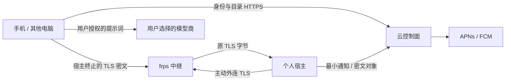

# WeftMate 轻云架构 · S0 已审查 / S1a 实现

依据：`VISION.md`「数据在哪里」、`PLAN.md` D20/D21 与第 9b 节 S1–S6、`CLIENT_API.md` 认证/设备/同步/健康、`COMPANION.md` 共养。S0 设计已审查合入；S1a 按第 2 节实现云账号与邮箱/OIDC，当前交付见第 12 节。宿主接线、内容授权与后续云能力仍按工作包派发，本包不部署。

## 1. 边界与数据位置

采用已定轻云 B：电脑宿主是内容与执行的权威；云是身份、发现与传递的控制面。手机副本是加密只读派生数据，离线产生的对话是待补交段。DSH 继续负责工具、任务、审批、压缩、子任务和调度，云不新增一套任务运行时。

| 位置 | 保存什么 | 不接收什么 |
|---|---|---|
| 每人的电脑宿主 | 本地账号与 ownerId、对话/附件/经验、MemoWeft、健康摘要、模型凭据、任务与审批；宿主/已信任客户端私钥 | 其他账号未授权的内容 |
| 手机/Watch | OS 保护的设备密钥；手机有加密记忆与近期对话副本、离线对话/排队意图；Watch 只取展示所需摘要 | 云端给所有人共享的记忆数据库 |
| WeftMate 云 | 邮箱/密码验证记录、云账号与设备公钥、宿主成员映射、连接状态、推送 token/最小事件、密文备份/包裹密钥、共享成员与授权元数据 | 对话正文、标题、记忆明文、健康摘要/原始样本、模型 API key、备份解密密钥 |
| 邮件/APNs/FCM | 邮件验证码；最小通知与送达所需身份/token | 对话正文、健康细节、记忆 |
| 用户选的云模型商 | 手机直连时用户发送的对话与本地选出的、获准使用的记忆片段 | WeftMate 云转存的全库；未经允许的健康来源及其衍生项 |

`COMPANION.md` 的“上传服务端”“服务端计算”在轻云中指**个人电脑宿主**，不是中央云；现有 H2 `/health/daily-summaries` 也仍落宿主。用户允许“云模型使用健康”只改变模型提示词权限，不允许中央云存明文。精灵状态本身可能间接反映健康，跨账号共享也需各自同意。

## 2. 身份、设备与现有账号绑定（S1）

### 2.1 云账号与令牌

云账号用不可变 `cloudAccountId`（OIDC `sub`，发行策略用 public subject，让同账号各官方客户端/宿主看到相同 sub），邮箱是可变登录名，不拿邮箱或用户名推导 ID。邮箱验证注册：发一次性验证码，验证邮箱所有权后完成账号创建；密码仅存带独立盐与参数的 scrypt 验证记录，复用现有宿主的参数设计并在 Linux 上测容量，不把本地密码哈希上传。公开登录面需要现有 PLAN 已要求的失败限速和验证码过期/单次使用，防撞库与验证码重放；不引入全局设备数上限或新审计框架。

推荐 **OIDC/OAuth 2.0 Authorization Code + PKCE（S256）**，用成熟 `oidc-provider` 实现协议，用 `jose` 验 JWT/JWK；WeftMate 只写账号、邮件交互与 SQLite adapter，不手写 OAuth/JWT 编解码。原生端用系统认证浏览器，公开客户端不嵌入 client secret；校验 state/nonce 和已登记 redirect URI，不用密码授权模式。浏览器云会话用 host-only Secure/HttpOnly Cookie 与 Origin/CSRF；原生刷新凭据放 Keychain/Keystore/系统凭据库，浏览器不把刷新凭据写 localStorage。依据 [OIDC 实现](https://github.com/panva/node-oidc-provider)、[jose](https://github.com/panva/jose)、[原生 OAuth 标准](https://www.rfc-editor.org/rfc/rfc8252)、[OAuth 安全最佳实践](https://www.rfc-editor.org/rfc/rfc9700)。

访问 token 初始建议 5 分钟，刷新 token 初始建议 30 天、轮换并检测复用，由 provider 管理授权族和撤销；会话状态按设备独立。发行者示例 `https://api.example.com/personal/v1/cloud/oidc`，audience 区分云控制面与指定宿主；宿主 token 含 `sub,device_id,host_id,scope,auth_epoch,iat,exp,jti` 与 DPoP `cnf.jkt`，不带用户内容。宿主只接受 access token，不用 ID token 授权 API。发行算法起步 RS256，私钥只在云配置，公开 JWKS 用 kid 轮换，旧公钥保留至已发 token 过期。客户端/宿主固定 issuer、audience、算法与 JWKS 地址，不信 token 内的任意 jku/x5u；未知 kid 可刷新一次，获取失败不降级为不验签。[JWT 安全标准](https://www.rfc-editor.org/rfc/rfc8725)

找回密码证明邮箱所有权，更新密码与 auth_epoch，撤销旧刷新族/云会话，通知本人。新设备先通过密码与邮箱确认，**这只授予云账号登录，不自动授予本地内容密钥或宿主执行权限**。换绑设备/宿主要求新邮件确认；内容侧还要下述已有设备/宿主的批准。邮件服务和云账号数据库都属于身份信任边界。

### 2.2 宿主认领与内容设备信任

1. 宿主本地生成独立安装密钥、TLS 内容密钥，记录现有 `hostId`，私钥不外传；主动请求注册挑战。已验证云账号在宿主 UI 登录，确认一次性认领挑战，宿主签名证明持有安装私钥。云保存宿主公钥与成员关系；注册半途退出只留可清理的 pending 元数据，不创建内容账号。
2. **绑定本地账号必须由该本地账号认证会话批准**：云证明“你是谁”，宿主决定“你对应哪个 ownerId”。本地持久保存 `(issuer,sub) → ownerId` 及已批准设备公钥。云端只保存 `(cloudAccountId,hostId,role)`，不能凭自己改目录映射让陌生 sub 接管已有 ownerId。
3. 客户端每台生成自己的认证密钥。首次内容配对通过宿主当面 QR（含宿主 TLS SPKI、公钥与一次性挑战），或现有已信任客户端经已验证连接批准；由宿主登记新的设备公钥。云邮件确认与本地内容信任是两个完成状态。云被攻破后可发假 JWT，但无法生成既有设备的私钥证明。
4. 客户端用标准 **DPoP** 在宿主会话交换时证明持有 token 绑定的公钥，宿主验证方法/URL、nonce、时间与重放，再检查该公钥已经在此 ownerId 的本地信任集合。DPoP 本身不负责配对，不把云发回的公钥自动当作本地信任。[DPoP 标准](https://www.rfc-editor.org/info/rfc9449)
5. 交换成功后宿主签发自己的 `wm_personal_session` 与 CSRF，保持 `/personal/v1` 的本地授权语义；凭据仍按本地 deviceId 归属。云令牌只送新的专用会话交换入口，绝不直接进入旧 Bearer 查 tokenHash 路径。内容设备撤销在宿主和云同步，关闭活跃流并拒绝下一次请求；云撤销事件由宿主校验并更新本地设备状态，断联时不能声称立即生效。

原生客户端保存配对得到的 TLS SPKI，并在 HTTPS 连接验证；证书续期保持同一密钥，换密钥由旧密钥签名且经已有信任连接更新。云目录返回的 pin 不是可信替代。全设备丢失时，通过本地恢复/恢复密钥与本人重新认领宿主，而非邮件登录自动取得全部内容。

一个账号有 `primaryHostId`，**数据归属通过 membership 表达，不限死一台电脑**；S1 首先实现一个默认内容宿主，S2 路由必须带确定的 hostId，后续 M3 扩多个执行宿主。离线不自动切换到另一个人的机器，不自动迁移数据；换默认宿主先恢复数据并在旧/新宿主完成映射，保留 ID 或记录显式迁移映射。

同一物理宿主可有多个成员账号，例如伴侣各绑定自己的 ownerId，默认无互读权限；不能因为认领了电脑就成为另一成员的内容管理员。现有 `legacyOwnerId` 同时参与电脑执行所有者判断，云绑定不把普通账号自动提权为电脑执行所有者，执行权限继续由宿主/DSH 决定。此隔离是应用级；共用同一 OS 管理员能读本机磁盘，不承诺硬件隔离。若要分别保护本机管理员，需不同 OS 用户/数据目录，是独立产品取舍。

### 2.3 无损迁移路径

现有代码已是根 `accounts[ownerId]` 多账号结构，legacy 格式由 `src/personal-access/index.mjs` 迁入，**保留旧 hostId/ownerId**；首个账号 sync 仍在 `<root>/sync`，其他账号在 `<root>/accounts/<ownerId>/sync`。健康文件在账号目录；记忆、会话、模型与设备来源依赖原 ID。`store.mjs` 校验现有格式，不能未经 schema 迁移随意加字段。

S1 宿主接线按以下次序做，全部用隔离夹具验收：

- 先备份本地 store 与相关数据，读取并检查当前账号；已登录本地 Cookie/CSRF 证明本地所有权，新鲜云登录/邮件证明云所有权，不能仅凭同名用户名/邮箱绑定。
- 增加版本化绑定存储与事务恢复：宿主先持久化 pending `(issuer,sub,ownerId,hostId,claimId)`，云幂等确认 membership，宿主再激活；重开后可继续同一 claimId。中途失败不换 ownerId、不建空内容账号、不移动目录。绑定占用/conflict 返回明确冲突，绝不合并两个现有账号。
- 保留本地 username、password verifier、Cookie/deviceId、sessionId、模型凭据、sync seq、健康来源与删除水位、MemoWeft 数据；内容不上传。用户名继续作为本地登录名/显示资料，云邮箱另存。旧 Cookie/合法 Bearer 可按原期限继续直连，绑定本身不轮换密码或撤销设备。
- 无密码 legacy 账号先沿用现有 **宿主直接地址 setup grant** 建立本地所有权，再绑定；不能把云账号登录改造成远程 `/auth/setup`，也不能绕过其 Origin/loopback 限制。
- 同一云账号/宿主仅绑定一个本地 ownerId；再次绑定幂等。多人共享宿主逐人完成，各自授权。解绑只撤销云映射/中继内容设备，数据和本地登录保留，不能等同删除账号。

云密码重置不修改本地密码、不解锁备份，不能借恢复流程接管电脑 shell。绑定后云认证设备的 epoch/revocation 与旧本地 `authEpoch` 分开；不让云失效事件顺带毁掉应急本地登录。

### 2.4 离线登录与契约接线

| 情况 | 可做什么 | 暂不可做什么 |
|---|---|---|
| 云在线，宿主离线，已有手机 | 云登录；设备解锁加密副本；直连模型聊天；本地记下电脑任务意图 | 读取最新宿主内容、执行电脑任务 |
| 云在线，宿主离线，全新设备 | 密码 + 邮件登录云，显示宿主离线；已有受信设备可授权传密钥 | 仅凭邮件获得旧内容；无恢复密钥时解密备份 |
| 云不可达，宿主可直连 | 继续未过期本地 Cookie，或本地密码登录；已批准设备用宿主本地认证 | 云新设备确认/云找回/新认领；过期云 JWT 自动延长 |
| 云与宿主都不可达 | 已信任手机本地解锁副本/本地草稿；有模型网络时直连模型 | 获得最新撤权/遗忘状态；离线密码伪验为云新登录 |

短 JWT 到期不能离线续签。已有本地会话仍用本地凭据，云 revocation 尚不可达的暴露窗口以本地会话有效期与已缓存撤权水位为限；需离线继续可用与立即云撤销不能同时保证，界面明确显示状态。无本地密码/有效会话的新设备等待联网与本地批准。

S1a 的云账号/OIDC 正式契约见 `CLIENT_API.md` 第 7 节，业务路径 `/personal/v1/cloud/…`，issuer 为 `/personal/v1/cloud/oidc`，客户端接入在后续包。备份/共享目录与宿主会话交换 `/personal/v1/auth/cloud-session` 尚未实现。后续实施包须协调五端并记录 STATE 契约变更。中继只改变宿主 base URL，不改原有路径/错误/Origin/CSRF；`auth/setup` 仍只允许直接地址。已有 `auth/login(username)` 与云 `email` 登录独立。

## 3. 中继方案与 TLS（S2）

以下为本项目接入成本与信任边界的判断，不是已跑的性能比较。

| 方案 | 优点 | 本项目代价与明文边界 | 结论 |
|---|---|---|---|
| 自写 WebSocket 反向 HTTP 通道 | 可复用单个 443，表面接入简单 | 需实现流复用/背压/重连/SSE/下载语义；普通云 HTTP 入口会看明文，套另一层 TLS 后仍需维护隧道协议 | 不推荐自研 |
| **frp HTTPS/SNI 透传** | 成熟跨平台 frpc/frps；宿主外连；多域名复用一个入口；直接承载已有 HTTPS/SSE/下载 | 额外 sidecar/端口、注册授权插件与宿主证书；正确透传时云只有 TLS 字节/元数据 | **推荐第一版** |
| WireGuard + headscale/Tailscale | 成熟设备间加密与穿 NAT；适合运维、受控设备网络 | headscale 是自托管 Tailscale 控制面；手机需 VPN/客户端与系统权限，普通浏览器/Watch 接入更复杂，多用户商业服务需额外网络管理 | 留作运维/高级直连选项 |
| Cloudflare Tunnel 发布 HTTP 应用 | 主动外连、托管边缘、少维护 | 常规 HTTP 发布在 Cloudflare 边缘终止 TLS，提供者可处理明文；private-network 模式另需客户端/网络方案 | 可用于无内容官网/控制面；不作内容默认入口 |

核对来源：[frp HTTP/HTTPS](https://gofrp.org/en/docs/features/http-https/)、[frp SNI 读取实现](https://github.com/fatedier/frp/blob/dev/pkg/util/vhost/https.go)、[headscale 说明](https://github.com/juanfont/headscale)、[Cloudflare Tunnel](https://developers.cloudflare.com/cloudflare-one/networks/connectors/cloudflare-tunnel/)、[Cloudflare TLS 边界](https://developers.cloudflare.com/ssl/concepts/)。

推荐拓扑分成两条连接：

1. **控制面**：`api.example.com:443 → Caddy → cloud Node 回环端口`。账号、邮件、目录由云处理，本来就会在云解密；不能携带内容。
2. **内容面**：客户端 `https://h-<opaque>.hosts.example.com:8443/personal/v1/… → frps vhostHTTPSPort → 宿主 frpc → 宿主本机 TLS 适配器 → 宿主 HTTP 回环入口`。宿主主动连 `relay.example.com` 的 frps 控制端口，frpc↔frps 强制 TLS 并验服务端证书；**内层内容 TLS 在宿主终止**。SNI 是公开的不含账号姓名的随机路由名。首次可用独立 8443，后续是否用 L4 SNI 分流统一 443 再据真实网络可达性决定，不能假设现有 Caddy HTTP reverse_proxy 能透传。

frps HTTPS mux 读取 ClientHello 的 ServerName 路由，不能解密 TLS 应用数据；外层 frp transport TLS 本身只能保护宿主到 frps，**单独开它不足以挡云读明文**。[frp 传输加密说明](https://gofrp.org/en/docs/features/common/network/network/) 第一版不使用云 HTTP reverse_proxy 转内容、不在云安装宿主内容私钥；不使用将内容 HTTPS 在云解密的插件或 CDN 橙云代理。

宿主本机 TLS 适配器可用 Caddy sidecar，私钥在宿主；适配器和宿主监听回环，不改成公网绑定。现有 `authentication.mjs` 仅接受配置的 allowedOrigin、loopback trustedProxy、匹配的 Host/X-Forwarded-Host/https；S2 将认领域名作为显式 public origin 配置，适配器覆盖转发头、拒绝客户端伪造，保留同源 Cookie 写入与 CSRF。内容 UI/静态资源也经同一宿主 TLS origin 提供，不能由中央云页面拿明文内容再渲染。

frps 不使用分发给所有人的共享 token：用成熟 server plugin 的 Login/NewProxy/Ping 等接注册目录，验证每宿主独立、可轮换的中继凭据；只批准属于该宿主的随机域名与 HTTPS 代理，防另一宿主抢域名或发布任意 TCP 服务。这是路由所有权验证，不限制模型工具。插件仅监听受控本机接口，撤销宿主时断开现有中继连接，不能只拒绝下一次 Login；S2 需验证所选 frp 版本的管理关闭接口。[frp server plugin](https://gofrp.org/en/docs/features/common/server-plugin/)

证书：宿主生成私钥，ACME 客户端在宿主完成证书取得/续期；云仅为认领域名提供 DNS-01 挑战记录的受权更新，不下发整个 DNS 管理密钥。可将每宿主 `_acme-challenge` 委托给受限验证区。原生端额外 pin 宿主 SPKI。CA 证书不能防域名控制者作恶：攻破云/DNS后攻击者可能申请另一个合法证书；已配对原生端的 pin 拒绝它。[DNS-01 官方说明](https://letsencrypt.org/docs/challenge-types/)

**浏览器边界**：普通浏览器无法用应用代码可靠 pin 初始 TLS 证书，云/DNS 被主动攻破后可冒充宿主网页并替换脚本。正常运营下云仍看不到透传内容，但不能承诺“云主动攻击时远程浏览器也绝对不可读”。S2 隔离测试/优先支持原生已配对客户端；远程浏览器是否接受此边界，或改用受信客户端/私网入口，由本人审查确认，不能对用户隐瞒。

第一版**必须**做端点 TLS、宿主 pin 与独立内容设备信任，才能满足轻云目标。额外的应用层消息 E2EE（JWE/MLS 等）、流量填充与私有 DNS 不在首版；不以“以后加 E2EE”为由先部署能看正文的云 HTTP 中继。传输成功不是任务完成，保留现有 SSE 重连、分页游标、requestId/附件校验；宿主离线按明确连接不可用呈现。

## 4. 推送转发（S3）

宿主按已授权 deviceId 提交事件，云校验宿主成员/推送目标，转发 APNs（HTTP/2 + provider token）或 FCM（HTTP v1 + OAuth）。APNs/FCM token 属于敏感设备标识，按云账号设备归属保存，撤销设备即停止发送；不能凭宿主提交的任意 token 推送给别人。[APNs 服务端](https://developer.apple.com/documentation/usernotifications/setting-up-a-remote-notification-server)、[FCM HTTP v1](https://firebase.google.com/docs/cloud-messaging/send/v1-api)

通知 payload 只含 `kind: new_message / approval_required / task_completed / reminder`、不含语义的 `sessionId`、`eventId`；展示只用“有新消息”“需要审批”等固定本地化文案。不含标题、模型输出、命令、路径、健康原因或伴侣状态。推送商与云仍能看到通知类型、会话标识与时间，这是明确的元数据泄露。客户端点击后通过宿主 TLS 拉取，并重新确认账号、设备、会话与实际审批状态；通知本身不能批准任务。

手机已离线也不能依赖后台推送稳定唤醒；FCM/APNs 接收不等于人已看到。用成熟服务返回的 invalid-token/retry 语义，重试保持 eventId，过时事件按业务有效期丢弃/合并，不开发新的可靠消息总线。Watch 的到达/震动取决于 Apple 的设备通知与前台/后台规则，需各端真机验收。规则与任务调度留在宿主 DSH，云不运行精灵健康分析。

## 5. 加密备份与恢复（S4）

推荐内容密钥**独立于云登录密码**：宿主首次启用备份生成随机 256-bit 用户恢复主密钥 R，保存 OS 凭据库，给用户导出恢复码/QR 离线保管；默认云不托管 R。用标准 HKDF-SHA256、明确目的字符串与账号/密钥版本上下文派生备份包裹密钥；每份快照另随机生成 DEK，避免备份、手机副本与共享对象复用同一数据密钥。新设备获得密钥须来自已受信设备的认证配对或用户输入恢复码，不能来自邮件确认后的任意云公钥。

宿主先生成一致快照、再加密上传；不直接打包运行中的 SQLite/JSON 半写状态，不将 DSH 活跃任务当作可自动续执行的状态。快照按 **ownerId 隔离导出**，不能把含其他成员的根 store 整个打包给单个账号；只保留该账号必要的 ID/来源映射、内容与其自有凭据，排除其他账号、宿主共用安装/TLS 私钥和未授权的共享模型凭据。恢复到新电脑生成新的宿主安装密钥，已有内容设备需重新建立对新宿主的信任。

推荐成熟 libsodium **secretstream XChaCha20-Poly1305** 做分块认证加密，包内 manifest/文件名/对话标题同样加密，验证 FINAL 标志防截断；DEK 用标准 AEAD 包裹、设备分发用成熟公钥密钥封装库，不自写密码协议。算法/版本/随机 salt/header、密钥版本及对象 ID 可公开；manifest 中的归属/快照版本需被认证。跨语言实现和损坏/截断/换账号用例是 S4 门槛。[libsodium secretstream](https://libsodium.gitbook.io/doc/secret-key_cryptography/secretstream)

如用户选择单独的“备份口令”包裹 R，使用 libsodium Argon2id 与随机 salt，保存算法/内存/计算参数；以库交互基线起步，在最低支持手机/电脑实测后固定参数，不拿云密码的 scrypt 哈希充当解密密钥。此口令不上传云；低熵口令在云密文泄露后仍会被离线猜测，随机恢复码更稳妥。[libsodium 密钥派生](https://libsodium.gitbook.io/doc/password_hashing/default_phf)

| 丢失情况 | 推荐方案的恢复结果 |
|---|---|
| 忘记云密码，仍有设备或恢复码 | 邮件重置云密码；R 未变，可恢复备份 |
| 所有设备丢失，但有恢复码/备份口令 | 新云登录 + 本地输入密钥恢复；新宿主重新认领 |
| 所有设备、恢复码、备份口令全部丢失 | 云账号可找回，**旧备份无法解密** |
| 希望邮件一键恢复所有内容 | 必须引入服务商托管密钥/第三方恢复，扩大信任与泄露面；不是轻云默认，需本人决定 |

改云密码不重加密内容；改备份口令只重包裹 R。怀疑 R 泄露时生成新版本并重加密仍保留的数据，旧泄露密文无法追回。服务端对象先暂存，完整上传/校验后提交清单，不把半个对象标为备份成功。下载须登录与对象归属授权，解密仍在宿主；服务器可拒绝/删除/回放旧密文，已持有快照水位的设备检测回退；全新恢复设备无外部可信水位时不能证明云给的是最新版本。

S4 起步磁盘对象目录 + SQLite 清单，后续需要容量/异机容灾时接 S3 兼容对象存储，只上传密文。对象级 retention、费用、删除策略需本人确认；不自动删除用户旧备份。恢复到新隔离目录验证，再由用户选择切换数据，不覆盖日用目录。

## 6. 跨账号共享目录（S5）

云保存随机 `spaceId`、成员云账号、邀请/接受/退出状态、授权范围、版本与权威宿主定位；**目录不存共享内容或可读标题**。发现用一次性邀请链接/QR，接收者登录后明确接受；不开放邮箱搜索/通讯录匹配。接受完成须各自宿主确认内容授权并认证对方设备密钥，云不能单方面把新成员加入内容信任集合。初版一个空间选一个权威宿主，避免新建分布式任务仲裁。

默认 `companion:state:read`：只分享各自选择的精灵状态/表情与互动状态，密文对象按已批准接收设备封装，或在线经来源宿主读取；不包含原始健康、每日摘要、指标来源/解释、私聊、长期记忆或模型凭据。状态更新由原宿主签名，撤权后不再封装给旧设备。共养数据的具体数值/状态可间接泄露健康或情绪，授权界面要说明。

共享对话是显式逐对话授权，权限区分读/写；共同任务的执行权来自选定宿主上的授权与 DSH 审批，不能由云共享目录自动赋予 shell 权限。现有 `/sync/conversations/{id}/shared` 是**同账号多设备对话接管**，不是跨账号共享；不拿它直接充当 S5 ACL。跨账号命名空间/设备 ID 映射需另改正式契约。

退出后撤销未来读取/写入与密钥包裹，发送成员版本变更/墓碑并让在线客户端清缓存；已经被成员解密的内容无法远程收回。历史记忆保留与真正遗忘仍由各自决定。退出后共享历史可否继续看、共同任务怎么收尾是 VISION/PLAN 已列待决定事项，S5 先实现目录/精灵状态，不默认替本人选共享对话退出规则。

## 7. 手机加密只读副本与离线补交（S6）

宿主从 MemoWeft 正式导出/召回契约生成只读副本，携带 cloudAccountId、本地 ownerId、hostId、记忆版本、权限/遗忘水位、来源引用、更新时间；仅含批准用于离线聊天的记忆与近期对话，手机不能直接改权威 World。若 Core 尚无带来源与遗忘语义的导出，S6 先补该依赖，不能另写一个记忆数据库冒充正式副本。健康事实及其衍生项继承 `cloudModelAllowed`，默认 false；不能用去掉“健康”标签的摘要绕过权限。

复用 S4 的成熟加密容器与设备密钥分发，独立快照密钥。宿主签名导出清单，手机验证已配对宿主签名/归属/版本，设备间密钥包裹只给本地批准的手机。云可暂存密文快照和按 hostId/deviceId 路由的更新目录，看不到来源、文本、标题或健康策略。手机保存到 OS 保护目录/加密数据库，需要用户解锁后才在内存解密。

电脑离线时，手机在**本机**检索副本、组装必要的记忆片段与新用户消息，直接调用用户选择的模型 API；模型凭据留在手机。此时模型商看到获准提示词，WeftMate 云不代理请求。没有可用模型/密钥则保留草稿并明确模型不可用。只聊天，无电脑工具调用/审批执行；电脑任务意图保存在手机加密队列（可取消），上线后经原宿主命令与 DSH 调度登记，取消标记先于执行检查；S6 不在云实现任务调度。

离线新对话用现有 sync 的 `conversationId/eventId/clientSeq` 与 message/turn.finished 结构，本地原子落盘后才展示已保存；不伪造来自宿主的 seq，也不租用必须连宿主的 local-turn 接口。手机独立离线段在补交前不跨设备并行拼同一 turn。重新接回：

1. 先核对账号/设备授权，拉权限/删除/遗忘水位，删本机旧副本与撤权内容，再允许其进入提示词；手机离线时无法获知远端新撤权，不能承诺即时删除。已登出/本机删账号立即清密钥和副本；损失设备由 OS 设备管理处理。
2. `/sync/events` 按原 eventId + 内容幂等分批补交，当前源 deviceId 与旧来源映射由宿主验证；收到持久化确认再移出队列，重试不重复消息/记忆。账号切换隔离队列，401 不跨账号上传。被删除的对话/来源不能被迟到消息复活，须扩正式契约的墓碑语义。
3. 宿主按现有 shared/adopt 与 cutover/lateSegment 语义接续，保持两套 seq 空间；主对话已前进时作为明确迟到段整理，不覆盖历史。离线手机消息由 DSH/MemoWeft 正式导入一次，不把助手推断当作用户认可，也不把副本本身再重复抽记忆。
4. 下发新的加密副本与水位，清旧版本；健康选择变为 false 后本机立刻停止使用，联网后传播来源/衍生过滤。真正遗忘同时处理手机副本、索引、缓存和后续包裹。

S4 历史备份可能仍含后来遗忘的数据。首次恢复须应用当前已知的删除/遗忘水位再开放检索；需要备份也实现不可恢复遗忘时必须重写/淘汰旧对象与相关密钥，无法消除已下载副本。具体保留策略在 S4/S6 联合验收前由本人决定，不能把“删除手机缓存”称为全球遗忘。

## 8. 威胁模型与实用边界

| 威胁 | 会泄露/能做什么 | 设计能保护什么 / 限制 |
|---|---|---|
| 云磁盘/数据库被读 | 邮箱、密码 verifier（可离线猜）、账号/设备/关系目录、推送 token、连接/对象大小时间、密文、凭据状态 | 不含内容/健康明文/恢复密钥；邮箱也属个人信息，不承诺零元数据 |
| 云被主动控制（含签名/DNS/推送凭据） | 发假身份、假通知、拒绝服务、改路由/目录、回放/删除密文、尝试新证书 | 已配对原生端 TLS pin + 宿主本地设备信任拒绝假端点/假设备；云 JWT 单独不够。新设备首次配对与远程普通浏览器仍需额外可信渠道 |
| 网络窃听/中继观察 | IP、SNI 路由、时间/流量、连接状态 | 内层 TLS/标准 AEAD 保护正文；不承诺隐藏流量分析 |
| 邮箱被接管 | 可重置云密码/确认新云设备 | 无本地受信设备或恢复密钥不能读取旧内容；仍需处理云目录破坏 |
| 手机丢失/恶意客户端/共享成员 | 解锁设备或已获授权成员可能导出自己能解密的内容 | OS 密钥保护、设备撤权/后续轮换；无法收回已知明文，不能保证离线瞬时撤权 |
| 宿主/本机管理员被攻破 | 该宿主账号内容、密钥、模型凭据与执行能力 | 内容端本身失守，轻云无力保护；保持 DSH 审批与 OS 权限，不扩大宿主网络监听 |

中继让宿主无需公网 IP、路由器端口映射或直接开放服务端口，减少被公网扫描的面。**经中继的宿主 API 仍是远程可达攻击面**，不能把主动外连误称为不可被攻击；保留认证、Origin/CSRF、账号隔离并维护宿主/TLS/frp 更新。公开路由只接本地 personal API/TLS adapter，不暴露 DSH RPC、SQLite、shell listener 或任意内网代理。云被攻破后的停机/换密钥/通知操作由后续运维流程处理，不新增审计证据框架。

## 9. 部署、存储与外部依赖

部署目标是现有 weftmate.com 的 Linux 云服务器，**本包未连接核查**。API 独立子域名，经 Caddy 自动 TLS 到 Node 回环；内容子域名的 TLS 由 frps 透传，DNS 不能启用解密内容的 CDN 代理。systemd 单进程 + DynamicUser/StateDirectory；发布目录与运行数据分开，不装主仓 Electron/DSH。草稿见 [services/cloud/deploy](../services/cloud/deploy/README.md)。[Caddy TLS](https://caddyserver.com/docs/automatic-https)

Node 24 `node:sqlite` 起步仅存控制面小记录，WAL/FK/事务迁移，密文对象落单独目录，备份使用 Online Backup API/`backup()` 一致快照。数据库、签名私钥、推送/邮件凭据与密文对象分开加密备份并异机保存；日志只有错误代码/随机操作 ID/状态/耗时，不记请求体/地址/token/邮件内容。先监控 `/healthz`、systemd、磁盘、备份恢复、TLS，再逐包加邮件/中继/推送计数。[Node 24 SQLite](https://nodejs.org/download/release/latest-v24.x/docs/api/sqlite.html)、[SQLite 一致备份](https://www.sqlite.org/backup.html)

当需要**多个写入实例/多服务器部署**、持续写锁争用影响登录/撤权、需要数据库高可用或在线运维窗口时换 PostgreSQL；按实测与部署需求触发，不用武断用户数阈值。保持稳定 IDs、事务约束、显式迁移与 provider adapter，避免依赖 SQLite rowid 作为业务 ID；SQLite DB 文件不放 NFS。对象增长/异机容灾独立触发 S3 兼容存储，不把它与换 DB 绑在一起。Node 同步 SQLite 不用于大备份加密/上传或长耗时查询。

| 需本人开通/提供 | 推荐与理由 | 未开通开发替代 | 工作包 |
|---|---|---|---|
| 邮件发送服务与发件域名 | **Resend** 起步：HTTP API 可用 Node fetch，接模板/幂等投递；不自行维护 SMTP。若投递区域/成本不符再评估 Postmark/SES，不预设购买套餐 | 本包 file outbox；只看本地 JSON，不发信 | S1 |
| DNS 管理 | 沿用现有域名服务商；API/relay/随机宿主域名、SPF/DKIM/DMARC，ACME TXT 验证委托最小权限；示例只用 example.com 与 203.0.113.10 | 本地 HTTP 与测试 TLS/自签配对；不修改真实 DNS | S1/S2 |
| Apple Developer 推送 key / App capability | 直接 **APNs provider token**，不增加第三方推送中间商；需要 Team ID/Key ID/.p8、正确 bundle topic 与 sandbox/production | 记录最小通知夹具，不声称手机/Watch 到达 | S3 |
| Firebase 项目与服务账号权限 | **FCM HTTP v1**，使用 Google 官方认证客户端获取短期 access token；不使用旧 server key API；Android 无 GMS 时不能声称 FCM 可达 | file/mock transport + 客户端轮询，真实设备能力另验 | S3 |
| 异机密文存储/监控告警（可选） | 磁盘先起步，出现容量/容灾需求再选 S3 兼容服务；沿用现有告警渠道可少开账号 | 隔离目录恢复测试、本地状态检查 | S4/部署 |

服务能力核对：[Resend API](https://resend.com/docs/api-reference/emails/send-email)、[APNs token 连接](https://developer.apple.com/documentation/usernotifications/establishing-a-token-based-connection-to-apns)、[FCM HTTP v1](https://firebase.google.com/docs/cloud-messaging/send/v1-api)。开通时再核实实时价格、地区与配额，本包不购买、不申请新增系统权限、不要求在聊天发送私钥。敏感授权与账户管理由本人在服务商 GUI 完成。

依赖策略：S0 零 npm 依赖；S1 拟加 oidc-provider/jose（协议成熟实现），S2 独立 frp 二进制与宿主 TLS/ACME 客户端（无需把隧道编进 Node），S3 必要时 Google 官方 auth 库（避免自写服务账号 OAuth），S4/S6 客户端成熟 libsodium bindings（避免自造加密）。实施时固定受支持版本/锁文件并验证各端兼容；不为零依赖目标牺牲协议正确性。

## 10. S1–S6 的范围、依赖与验收

所有验收先隔离数据目录/测试账号，真实服务商验证须在相应授权开通后；不能以 mock 通过替代真机或公网验收。

| 工作包 | 范围 | 依赖 | 必须验收 |
|---|---|---|---|
| S1 账号/邮箱/绑定 | 成熟 OIDC、注册/找回/新云设备邮件、JWKS/撤销、宿主注册、无损绑定、独立内容设备信任与 session exchange | S0 审查；W-Core 与五端协同契约；邮件/DNS；配对 UI | 注册未验证不得激活；验证码重放/登录失败；token issuer/aud/算法/过期与轮换；A/B 同机互隔离；改云密码保留本地数据；旧 ID/密码/Cookie/同步水位不变；认领中断/重启恢复；假云身份无设备私钥仍无内容权限；宿主/云离线矩阵 |
| S2 中继 | frpc sidecar 生命周期、frps 注册插件、HTTPS 透传、宿主 TLS/ACME 与 pin、Origin 接线、离线状态 | S1 身份/本地信任；DNS；Windows/macOS 宿主与五端网络接线 | 宿主仅外连/回环；跨实际公网访问同 `/personal/v1`；云侧抓包/日志无正文；假证书/pin 替换/跨宿主域名抢占被拒；撤销关闭现有通道；SSE/下载/断网重连/重复请求；Windows/macOS + iOS/Android/Watch；浏览器风险有明确决定 |
| S3 推送 | 设备 token 注册/撤销、最小事件、APNs/FCM transport、错误/失效 token 与重复事件处理 | S1 设备/S2 拉内容；Apple/Firebase；各端通知权限 | 无正文/标题/健康内容；只发同账号授权设备；点击再认证/再读状态；开发 mock 与真 APNs sandbox/FCM 分别标记；手机/Watch 前后台实际到达，不以 provider 接收当震动 |
| S4 加密备份 | 一致快照、随机恢复密钥/独立 DEK、成熟加密容器、上传清单/恢复、版本与损坏处理 | S1 归属；宿主备份/MemoWeft 一致导出；恢复/保留产品决定 | 云无解密密钥；换电脑隔离恢复；改/忘云密码仍可恢复；丢恢复密钥明确不可恢复；篡改/截断/回放检测边界；断上传/重试；账号混用拒绝；restore 不覆盖原数据；异机快照恢复验证 |
| S5 共享目录 | 邀请/接受/退出、成员与授权版本、默认精灵状态密文分发；共享对话另有明确规则后实现 | S1/S2；S4 加密组件；M4 精灵；M5 退出规则 | 双方接受/宿主授权；默认无健康明文/私聊；云篡改成员无密钥；撤权后不再分发；旧解密副本边界说明；同账号 sync/shared 不冒充跨账号；任务执行权不自动放大 |
| S6 手机副本 | 正式只读导出、加密同步/本地检索、手机直连模型、离线段补交/遗忘与撤权水位 | S1/S2/S4；M2/MemoWeft 导出与来源过滤；M3 同步/墓碑；手机模型选择 | Windows/macOS 导出与 iOS/Android 解密兼容；离线聊天用记忆但无电脑工具；健康未允许不进云提示词；断网/重启后原 eventId 补交不重复；取消意图不执行；账号切换队列隔离；遗忘/撤权先于提示词与补交；旧备份恢复不复活已知删除项 |

建议顺序 S1 → S2；S3/S4 在各自依赖满足后独立推进；S5 待共养/退出规则，S6 待记忆与移动同步契约。本人需开通的项做到相应包再提醒；未开通可完成 mock 接线，不标为生产验收。

**首版可不做**：应用层消息 E2EE/MLS、P2P 自动选路、多区域/多写实例/Postgres、CDN 内容代理、会员计费、云端模型代理、云端健康/记忆分析、自动备份密钥托管、云端任务调度、跨账号 shared-chat（退出规则未定）。这些不削弱已经明确必做的内容 TLS、原生 pin、宿主独立设备授权与加密备份。

待本人/Claude 审查的产品取舍：远程普通浏览器在主动云/DNS 攻击下的信任边界；新设备邮箱登录后还需已有设备/宿主批准内容的体验；恢复码丢失不可恢复与是否提供额外托管模式；备份保留/真正遗忘关系；共养退出后的历史与任务规则；手机模型商/健康授权；外部服务的开通、费用与域名/端口安排。**不阻塞 S0 文档和骨架完成，不代替本人开通或默认接受这些取舍。**

## 11. S0 实际交付与未验证

`services/cloud/` 已实现：Node 24 ESM package、环境变量配置、`GET /healthz`（读 DB）、SQLite 连续 SQL 迁移/事务/版本检查、JSON 操作日志、file 邮件接口、README、systemd/Caddy/环境文件部署草稿。没有账号表/认证/宿主接线或 S1–S6 路由；`/personal/v1` 未改变。

本地 Node 24.21.0 `node --test test/*.test.mjs`：**14/14 通过**，全部使用临时数据/测试邮箱/随机端口；包含真实 Node 进程的启动、HTTP 健康与 SIGTERM。Linux CI 在主仓现有 Linux job 增加独立 cloud 步骤，不增加其他 OS cloud 测试。远端 CI 状态看本包 PR，不把付款/额度导致未启动称作测试失败或通过。

未验证：目标 Linux/systemd/Caddy 实际部署、公网 frp/SSE/TLS/pin、真实邮件/APNs/FCM、账号无损绑定、备份加解密、共享与手机副本。这些都是后续包的实现与验收，本包无服务器连接/部署，完成后停在 S0 等审查。

## 12. S1a 当前交付与边界

独立 `services/cloud/` 按第 2 节实现云账号，契约在 `CLIENT_API.md` 第 7 节，客户端接入在后续包。不可变随机 cloudAccountId/public sub、规范化唯一可变邮箱、独立盐和参数的 scrypt；pending 注册验证后激活，密码找回与换邮箱递增 epoch、撤销旧云会话/授权码/刷新族/旧验证码；新设备标识或公钥经邮箱确认后才签发授权码。设备标识/公钥目前由客户端声明，无私钥持有证明，不自动授权内容。

协议使用锁定 `oidc-provider 9.12.2` / `jose 6.2.12` 和 SQLite adapter，强制 Code+PKCE S256、登记 redirect、public/native 无 secret；RS256 access/ID token 300 秒，code 60 秒，refresh 轮换/复用检测且族绝对寿命 30 天。audience 只为云 `/personal/v1/cloud`，不发宿主 token/host_id/DPoP cnf。签名私钥与 Cookie/验证码秘密独立私有文件，停服务轮换并重启，旧 key 保留 300+60 秒；具体命令见 cloud README。

验证码六位、10 分钟、单次使用/5 次错误，绑定用途、账号 epoch 与登录交互；账号及来源的失败桶持久化，第 5 次起指数退避，邮件请求另限速。HTTPS host-only Secure/HttpOnly Cookie、同源 Origin、交互 Cookie/CSRF 与固定 Host；代理来源只在显式可信回环设置启用。没有全局设备数上限或审计框架。file 开发邮件与环境变量配置的 Resend/五类模板已实现；Resend 未配置不可启用，测试仅 mock fetch。密码更改通知失败时响应 notificationAccepted=false，已提交重置保持有效；未做通知补投递。

Mac Node 24.21.0 隔离 `node --test test/*.test.mjs` **30/30**，cloud npm audit **0 漏洞**；覆盖完整账号/授权码/刷新/恢复/新设备、验证码/限速、令牌校验/轮换/并发复用、JWKS 轮换/重开、邮箱变更、HTTPS Cookie 与原 S0 测试。Linux cloud 使用现有独立步骤，缺依赖时测试 helper 只安装 cloud 的锁文件；远端结果见本包 PR。scrypt N=131072/r=8/p=1 的实际 runner 耗时在测试输出记录，不推断生产吞吐。

未做/未验证：五端登录接线、宿主验签/DPoP/会话交换/认领/内容设备授权（S1b，待新设备体验决定）、真实邮件送达、服务器/systemd/Caddy/DNS 部署、S2–S6。未连接服务器、不发真实邮件、不碰日用数据。外部离线验证的 JWT 在刷新撤销后仍有最多 5 分钟有效窗口；本服务检查实时 epoch，但宿主即时撤销尚未接线。
