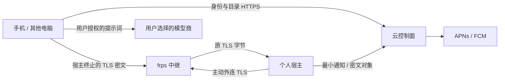
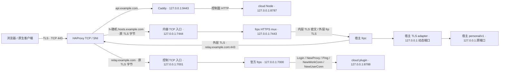

# WeftMate 轻云架构 · S0 已审查 / S1a–S2 实现

依据：`VISION.md`「数据在哪里」、`PLAN.md` D20/D21 与第 9b 节 S1–S6、`CLIENT_API.md` 认证/设备/同步/健康、`COMPANION.md` 共养。S0 设计已审查合入；S1a 云账号/邮箱/OIDC 与 S1b 宿主身份/内容设备授权已实现，当前交付见第 3、12–13 节。完整客户端与后续云能力仍按工作包派发，本包不部署。

## 0. 本人已定的取舍（2026-10-07）

| 问题 | 决定 |
|---|---|
| 新设备访问内容 | 邮箱 + 密码只登录云；访问对话和记忆还需已登录设备点「允许」或扫电脑二维码（PLAN D23）。批准请求通过推送（S3）送到已有设备，一次点按完成。 |
| 远程普通浏览器 | 允许（D24）。接受主动云 / DNS 攻击下浏览器可能被冒充的边界；原生端保留 SPKI 固定。 |
| 备份钥匙 | 只有用户自己（D25）：恢复码 / 已受信设备；不提供服务器代管；全部丢失则旧备份不可恢复，启用备份时明确提示。 |
| 中继端口 | 第一版即用 443，按 SNI 在同一 443 上分流控制面与内容面（审查要求，见 PR #27 评论）。 |
| 邮件与 DNS | 邮件先用 Resend 免费版；国内邮箱送达不佳再加阿里云邮件推送。DNS 在阿里云，记录由本人添加；ACME DNS-01 用仅限 DNS 的 RAM 子账号密钥，本人直接配置到服务器（PLAN D26）。 |

## 1. 边界与数据位置

采用已定轻云 B：电脑宿主是内容与执行的权威；云是身份、发现与传递的控制面。手机副本是加密只读派生数据，离线产生的对话是待补交段。DSH 继续负责工具、任务、审批、压缩、子任务和调度，云不新增一套任务运行时。

| 位置 | 保存什么 | 不接收什么 |
|---|---|---|
| 每人的电脑宿主 | 本地账号与 ownerId、对话/附件/经验、MemoWeft、健康摘要、模型凭据、任务与审批；宿主/已信任客户端私钥 | 其他账号未授权的内容 |
| 手机/Watch | OS 保护的设备密钥；手机有加密记忆与近期对话副本、离线对话/排队意图；Watch 只取展示所需摘要 | 云端给所有人共享的记忆数据库 |
| WeftMate 云 | 邮箱/密码验证记录、云账号与设备公钥、宿主成员映射、连接状态、推送 token/最小事件、密文备份/包裹密钥、共享成员与授权元数据 | 对话正文、标题、记忆明文、健康摘要/原始样本、模型 API key、备份解密密钥 |
| 邮件/APNs/FCM | 邮件验证码；最小通知与送达所需身份/token | 对话正文、健康细节、记忆 |
| 用户选的云模型商 | 手机直连时用户发送的对话与本地选出的、获准使用的记忆片段 | WeftMate 云转存的全库；未经允许的健康来源及其衍生项 |

`COMPANION.md` 的“上传服务端”“服务端计算”在轻云中指**个人电脑宿主**，不是中央云；现有 H2 `/health/daily-summaries` 也仍落宿主。用户允许“云模型使用健康”只改变模型提示词权限，不允许中央云存明文。精灵状态本身可能间接反映健康，跨账号共享也需各自同意。

## 2. 身份、设备与现有账号绑定（S1）

### 2.1 云账号与令牌

云账号用不可变 `cloudAccountId`（OIDC `sub`，发行策略用 public subject，让同账号各官方客户端/宿主看到相同 sub），邮箱是可变登录名，不拿邮箱或用户名推导 ID。邮箱验证注册：发一次性验证码，验证邮箱所有权后完成账号创建；密码仅存带独立盐与参数的 scrypt 验证记录，复用现有宿主的参数设计并在 Linux 上测容量，不把本地密码哈希上传。公开登录面需要现有 PLAN 已要求的失败限速和验证码过期/单次使用，防撞库与验证码重放；不引入全局设备数上限或新审计框架。

推荐 **OIDC/OAuth 2.0 Authorization Code + PKCE（S256）**，用成熟 `oidc-provider` 实现协议，用 `jose` 验 JWT/JWK；WeftMate 只写账号、邮件交互与 SQLite adapter，不手写 OAuth/JWT 编解码。原生端用系统认证浏览器，公开客户端不嵌入 client secret；校验 state/nonce 和已登记 redirect URI，不用密码授权模式。浏览器云会话用 host-only Secure/HttpOnly Cookie 与 Origin/CSRF；原生刷新凭据放 Keychain/Keystore/系统凭据库，浏览器不把刷新凭据写 localStorage。依据 [OIDC 实现](https://github.com/panva/node-oidc-provider)、[jose](https://github.com/panva/jose)、[原生 OAuth 标准](https://www.rfc-editor.org/rfc/rfc8252)、[OAuth 安全最佳实践](https://www.rfc-editor.org/rfc/rfc9700)。

访问 token 初始建议 5 分钟，刷新 token 初始建议 30 天、轮换并检测复用，由 provider 管理授权族和撤销；会话状态按设备独立。发行者示例 `https://api.example.com/personal/v1/cloud/oidc`，audience 区分云控制面与指定宿主；宿主 token 含 `sub,device_id,host_id,scope,auth_epoch,iat,exp,jti` 与 DPoP `cnf.jkt`，不带用户内容。宿主只接受 access token，不用 ID token 授权 API。发行算法起步 RS256，私钥只在云配置，公开 JWKS 用 kid 轮换，旧公钥保留至已发 token 过期。客户端/宿主固定 issuer、audience、算法与 JWKS 地址，不信 token 内的任意 jku/x5u；未知 kid 可刷新一次，获取失败不降级为不验签。[JWT 安全标准](https://www.rfc-editor.org/rfc/rfc8725)

找回密码证明邮箱所有权，更新密码与 auth_epoch，撤销旧刷新族/云会话，通知本人。新设备先通过密码与邮箱确认，**这只授予云账号登录，不自动授予本地内容密钥或宿主执行权限**。换绑设备/宿主要求新邮件确认；内容侧还要下述已有设备/宿主的批准。邮件服务和云账号数据库都属于身份信任边界。

### 2.2 宿主认领与内容设备信任

1. 宿主本地生成独立安装密钥、TLS 内容密钥，记录现有 `hostId`，私钥不外传；主动请求注册挑战。已验证云账号在宿主 UI 登录，确认一次性认领挑战，宿主签名证明持有安装私钥。云保存宿主公钥与成员关系；注册半途退出只留可清理的 pending 元数据，不创建内容账号。
2. **绑定本地账号必须由该本地账号认证会话批准**：云证明“你是谁”，宿主决定“你对应哪个 ownerId”。本地持久保存 `(issuer,sub) → ownerId` 及已批准设备公钥。云端只保存 `(cloudAccountId,hostId,role)`，不能凭自己改目录映射让陌生 sub 接管已有 ownerId。
3. 客户端每台生成自己的认证密钥。首次内容配对通过宿主当面 QR（含宿主 TLS SPKI、公钥与一次性挑战），或现有已信任客户端经已验证连接批准；由宿主登记新的设备公钥。云邮件确认与本地内容信任是两个完成状态。云被攻破后可发假 JWT，但无法生成既有设备的私钥证明。
4. 客户端用标准 **DPoP** 在宿主会话交换时证明持有 token 绑定的公钥，宿主验证方法/URL、nonce、时间与重放，再检查该公钥已经在此 ownerId 的本地信任集合。DPoP 本身不负责配对，不把云发回的公钥自动当作本地信任。[DPoP 标准](https://www.rfc-editor.org/info/rfc9449)
5. 交换成功后宿主签发自己的 `wm_personal_session` 与 CSRF，保持 `/personal/v1` 的本地授权语义；凭据仍按本地 deviceId 归属。云令牌只送新的专用会话交换入口，绝不直接进入旧 Bearer 查 tokenHash 路径。内容设备撤销在宿主和云同步，关闭活跃流并拒绝下一次请求；云撤销事件由宿主校验并更新本地设备状态，断联时不能声称立即生效。

原生客户端保存配对得到的 TLS SPKI，并在 HTTPS 连接验证；证书续期保持同一密钥，换密钥由旧密钥签名且经已有信任连接更新。云目录返回的 pin 不是可信替代。全设备丢失时，通过本地恢复/恢复密钥与本人重新认领宿主，而非邮件登录自动取得全部内容。

一个账号有 `primaryHostId`，**数据归属通过 membership 表达，不限死一台电脑**；S1 首先实现一个默认内容宿主，S2 路由必须带确定的 hostId，后续 M3 扩多个执行宿主。离线不自动切换到另一个人的机器，不自动迁移数据；换默认宿主先恢复数据并在旧/新宿主完成映射，保留 ID 或记录显式迁移映射。

同一物理宿主可有多个成员账号，例如伴侣各绑定自己的 ownerId，默认无互读权限；不能因为认领了电脑就成为另一成员的内容管理员。现有 `legacyOwnerId` 同时参与电脑执行所有者判断，云绑定不把普通账号自动提权为电脑执行所有者，执行权限继续由宿主/DSH 决定。此隔离是应用级；共用同一 OS 管理员能读本机磁盘，不承诺硬件隔离。若要分别保护本机管理员，需不同 OS 用户/数据目录，是独立产品取舍。

### 2.3 无损迁移路径

现有代码已是根 `accounts[ownerId]` 多账号结构，legacy 格式由 `src/personal-access/index.mjs` 迁入，**保留旧 hostId/ownerId**；首个账号 sync 仍在 `<root>/sync`，其他账号在 `<root>/accounts/<ownerId>/sync`。健康文件在账号目录；记忆、会话、模型与设备来源依赖原 ID。`store.mjs` 校验现有格式，不能未经 schema 迁移随意加字段。

S1 宿主接线按以下次序做，全部用隔离夹具验收：

- 先备份本地 store 与相关数据，读取并检查当前账号；已登录本地 Cookie/CSRF 证明本地所有权，新鲜云登录/邮件证明云所有权，不能仅凭同名用户名/邮箱绑定。
- 增加版本化绑定存储与事务恢复：宿主先持久化 pending `(issuer,sub,ownerId,hostId,claimId)`，云幂等确认 membership，宿主再激活；重开后可继续同一 claimId。中途失败不换 ownerId、不建空内容账号、不移动目录。绑定占用/conflict 返回明确冲突，绝不合并两个现有账号。
- 保留本地 username、password verifier、Cookie/deviceId、sessionId、模型凭据、sync seq、健康来源与删除水位、MemoWeft 数据；内容不上传。用户名继续作为本地登录名/显示资料，云邮箱另存。旧 Cookie/合法 Bearer 可按原期限继续直连，绑定本身不轮换密码或撤销设备。
- 无密码 legacy 账号先沿用现有 **宿主直接地址 setup grant** 建立本地所有权，再绑定；不能把云账号登录改造成远程 `/auth/setup`，也不能绕过其 Origin/loopback 限制。
- 同一云账号/宿主仅绑定一个本地 ownerId；再次绑定幂等。多人共享宿主逐人完成，各自授权。解绑只撤销云映射/中继内容设备，数据和本地登录保留，不能等同删除账号。

云密码重置不修改本地密码、不解锁备份，不能借恢复流程接管电脑 shell。绑定后云认证设备的 epoch/revocation 与旧本地 `authEpoch` 分开；不让云失效事件顺带毁掉应急本地登录。

### 2.4 离线登录与契约接线

| 情况 | 可做什么 | 暂不可做什么 |
|---|---|---|
| 云在线，宿主离线，已有手机 | 云登录；设备解锁加密副本；直连模型聊天；本地记下电脑任务意图 | 读取最新宿主内容、执行电脑任务 |
| 云在线，宿主离线，全新设备 | 密码 + 邮件登录云，显示宿主离线；已有受信设备可授权传密钥 | 仅凭邮件获得旧内容；无恢复密钥时解密备份 |
| 云不可达，宿主可直连 | 继续未过期本地 Cookie，或本地密码登录；已批准设备用宿主本地认证 | 云新设备确认/云找回/新认领；过期云 JWT 自动延长 |
| 云与宿主都不可达 | 已信任手机本地解锁副本/本地草稿；有模型网络时直连模型 | 获得最新撤权/遗忘状态；离线密码伪验为云新登录 |

短 JWT 到期不能离线续签。已有本地会话仍用本地凭据，云 revocation 尚不可达的暴露窗口以本地会话有效期与已缓存撤权水位为限；需离线继续可用与立即云撤销不能同时保证，界面明确显示状态。无本地密码/有效会话的新设备等待联网与本地批准。

S1a 的云账号/OIDC 正式契约见 `CLIENT_API.md` 第 7 节，业务路径 `/personal/v1/cloud/…`，issuer 为 `/personal/v1/cloud/oidc`，客户端接入在后续包。S1b 已实现宿主认领/绑定/DPoP 与 `/personal/v1/auth/cloud-session`，具体见 CLIENT_API 7.4–7.5；备份/共享目录仍在后续包。后续实施包须协调五端并记录 STATE 契约变更。中继只改变宿主 base URL，不改原有路径/错误/Origin/CSRF；`auth/setup` 仍只允许直接地址。已有 `auth/login(username)` 与云 `email` 登录独立。

## 3. 中继方案与 TLS（S2 已实现，本包不部署）

固定使用官方 [frp v0.71.0](https://github.com/fatedier/frp/releases/tag/v0.71.0)。`scripts/download-frp.mjs` 只从 fatedier/frp GitHub Releases 下载，内置 macOS/Linux/Windows x64/arm64 的 SHA256（取自该发布资产 digest），校验后解压到被忽略的 `.local/frp/`；二进制、密钥、运行目录不进 Git。此版 HTTPS mux 只按 ClientHello SNI 路由，内层 TLS 在宿主终止。[官方 HTTPS 说明](https://gofrp.org/en/docs/features/http-https/)

### 3.1 单一公网 443

部署草稿在 `services/cloud/deploy/`：HAProxy 拥有公网 TCP 443，未知/缺少 SNI 拒绝；内容与 frpc 控制传输均为 TCP 透传。控制 API 才由 Caddy 解密；API 后端使用 PROXY v2 + Caddy 的回环受信 listener wrapper 保留真实来源，覆盖 HTTP 转发头供云限速使用。内容路径不发送 PROXY 协议，不进入 Caddy HTTP reverse_proxy。只需一个公网 TCP 443，不开放 frps/Node/plugin/adapter 回环端口，也不需要公网 8443。QUIC、KCP、HTTP 代理、TCP 发布和 CDN TLS 终止均未启用。

### 3.2 目录、凭据与撤销

`services/cloud/src/relay.mjs` 接 S1b 的安装公钥与 membership，数据库迁移 004 保存宿主随机域名、凭据 generation、撤销状态与连接水位。已认领安装使用原 ES256、短期且防重放的 host proof 取凭据；云 HMAC 派生每宿主/generation 的独立秘密，不向用户分发共享 frp token。宿主本机 `relay/frpc.toml` 使用私有权限，云不在响应日志中记录秘密。

Login 校验安装对应的独立凭据；NewProxy 仅批准 `<hostId>.content`、`type=https` 和该宿主唯一的 `h-<128-bit 随机>.hosts.example.com`，拒绝他人域名、大小写绕过、子域替代、共享组和任意 TCP 服务。Ping/NewWorkConn/NewUserConn 重新检查 generation、active 与 membership。最后一个成员解绑也撤销中继；仅某个成员解绑不切断其他成员的宿主路由。

**主动关闭的实测结论**：此版 frps 没有踢在线 client 的管理接口，`DELETE /api/proxies` 仅清理 offline；Ping 插件拒绝只回错误 Pong，不能据此宣称立即断流。[固定版管理路由](https://github.com/fatedier/frp/blob/v0.71.0/server/api_router.go)、[管理删除实现](https://github.com/fatedier/frp/blob/v0.71.0/server/http/controller.go)、[Ping 处理](https://github.com/fatedier/frp/blob/v0.71.0/server/control.go)

因此云拥有两个必经、**不解析 TLS / 不实现隧道协议**的 TCP 入口。官方插件 Login 的 `client_address` 与 NewUserConn 的 `remote_addr` 对应入口连到 frps 的回环 socket；插件将 socket 关联到已验证宿主。撤销先落盘，随后销毁该宿主的控制和内容 socket，立即关闭已有 SSE/下载；其他宿主连接保留。凭据轮换递增 generation、关闭旧连接，宿主重启 frpc 使用新秘密，域名与 TLS pin 保持。所有 frps 内部 listener 必须只监听回环且仅受信服务进程可访问；绕过这两个入口不是受支持部署。

目录 discover 只向该宿主成员返回 base URL 与 online/offline/revoked，不返回 pin/秘密。online 表示最近 15 秒收到有效连接/心跳，控制连接关闭或 cloud 重启即清除水位；不保证请求已经送达宿主。宿主 `/status.relay` 根据 frpc 私有管理接口的代理 running 状态返回实际连接情况。

### 3.3 宿主 TLS、生命周期与证书

`src/personal-relay/` 随个人访问服务启动、退出；frpc 自带断线重连，本包只管理进程生命周期与状态。IPC sidecar 在宿主意外退出时也停止 frpc；正常退出等待子进程关闭并销毁 adapter socket。宿主原 HTTP 与 TLS adapter 均监听 `127.0.0.1`。adapter 仅接受已认领域名的 SNI/Host，拒绝客户端 Forwarded/X-Forwarded-*，移除 hop-by-hop 头，写入固定 `Host/X-Forwarded-Host/X-Forwarded-Proto=https`。认领 origin 加入显式允许列表；Cookie 同源写入、Secure、CSRF 与 `/auth/setup` 仅直连语义保持。

TLS adapter 直接使用 **S1b identity.json 已生成的内容私钥**，校验证书域名及 SPKI 匹配；不会生成另一把不匹配配对 pin 的 key。已认证、电脑直接地址的 `/cloud/pairings` 返回原 `tlsSpki` 和新增 `relay` 状态/baseUrl，原生端从当面配对/已有信任通道保存 pin，不能信云目录替代。证书正常续期保留同一密钥，`reloadRelayCertificate()` 可热换证书；换密钥的旧钥签名/客户端更新流程留给后续包，当前拒绝 pin 不一致的证书。

- 开发/测试：`WEFTMATE_RELAY_DEVELOPMENT_TLS=true`，OpenSSL 在隔离宿主目录生成 7 天开发 CA，签署原内容 key 的 CSR；测试客户端显式信这份 CA，不改系统信任。
- 生产（S2b）：`WEFTMATE_RELAY_ACME_ENABLED=true` 后，宿主进程内的固定 Node ACME.js 客户端用现有内容 JWK 生成 CSR、通过安装 proof 请求 DNS-01；不依赖 Windows certbot/OpenSSL。ACME 目录可配置为生产 Let's Encrypt、staging 或隔离 Pebble，账号 key 按目录独立存在宿主私有文件，内容 key 不离开宿主。库的可选 maintainer 联系/locale 注册已关闭；旧版 processing 订单由库自身签名工具按 RFC8555 POST-as-GET 轮询，Pebble 已验证。
- 签发/续期：启动与每天检查，剩余 <30 天重签；失败按天重试并持久化重试日期，保留已有证书。成功校验域名/SPKI/有效期后，0600 原子安装 fullchain、`setSecureContext` 热载，不重启宿主/frpc，不中断既有 TLS 连接。`WEFTMATE_RELAY_CERT_FILE` 可指定安装位置，默认私有 `relay-tls/host-fullchain.pem`；`/status.relay` 新增 `certificateExpiresAt`（UTC/null）与 `certificateErrorCode`（代码/null）。staging 与生产使用独立证书路径，staging 不被普通浏览器信任。
- 云 DNS 权限：只接受 43 字符 base64url TXT 值，记录名固定为 `_acme-challenge.<此宿主认领的完整域名>`；不接受 caller 指定 zone/name/type/TTL，不给宿主全区 DNS API key。`services/cloud/src/dns-aliyun.mjs` 通过官方 OpenAPI V3 ACS3-HMAC-SHA256 调用 AddDomainRecord/DeleteDomainRecord，免费 AliDNS 区将内部 TTL=60 提升到最低 600 秒。每个权威 NS 都查到 TXT 后才返回，约 90 秒超时给 `DNS_PROPAGATION_TIMEOUT`；宿主允许 DNS 请求 125 秒。API 失败给 `DNS_PROVIDER_ERROR`，不返回凭据或阿里云原始错误正文。
- RecordId 所有权保存在云 SQLite schema **5** 的 `relay_dns_records`：重试复用已写入 ID，cleanup 只删本次值对应的服务自有 ID，保留并发/预存 TXT，缺失记录幂等；掉电残留由本人私下核对清理，后台清扫未做。`main.mjs` 从私有服务器环境读取 `CLOUD_DNS_PROVIDER=aliyun`、`ALIYUN_DNS_ZONE`、`ALIYUN_DNS_ACCESS_KEY_ID/SECRET` 接线；缺任一项仍为 `DNS_NOT_CONFIGURED`（503）。RAM 仅授权指定域名区的增删 DNS 权限，本人操作步骤见 [部署说明](../services/cloud/deploy/README.md#宿主内容证书s2b阿里云-dns-01)。[DNS-01 官方流程](https://letsencrypt.org/docs/challenge-types/)

D24 已允许普通浏览器：正常透传时云只有密文；若云/DNS 被完全主动控制，普通浏览器可能被合法新证书和被替换页面冒充。已配对原生端还验证宿主 SPKI；云目录不获权更改 pin。S1c 负责真实客户端保存/校验。本包不新增应用层 JWE/MLS、模型任务调度或消息 E2EE。

### 3.4 可重复验证与部署界线

隔离全链路测试 `services/cloud/test/relay-e2e.test.mjs` 使用官方 frps/frpc、真实 HAProxy、cloud OIDC/SQLite、真实宿主 TLS adapter；`--resolve` 与测试连接地址覆盖模拟示例域名。覆盖远程本地密码登录/CSRF/setup 拒绝、SSE 更新、2,200 事件尾页/上翻、附件 SHA256 下载、切断控制通道后重连、凭据轮换、已认领另一宿主抢域名拒绝、错误 pin/同域受信 CA 伪造证书拒绝及云撤销立即断流、直连继续可用。云内容入口采集双向原始 TLS 字节，搜索测试正文/密码/Cookie 明文，结合 frps/cloud 日志检查；这是测试流量证据，不声称隐藏 SNI、流量大小和时间。

Mac 无免密码 443 绑定权限，本机用 18443 跑完全相同 SNI 拓扑与 443 TLS authority；不改 hosts、不获取管理员密码。`.github/workflows/relay.yml` 在隔离 Linux 给 HAProxy 绑定能力，默认**实际 TCP 443**，重复完整场景并上传无秘密 JSON 报告。类型检查、cloud 测试、Origin/绑定/附件/SSE 回归另跑。S2b 另有 `Host certificates (Pebble DNS-01)`：官方固定 Pebble/challtestsrv、真实 DNS、假 AliDNS API、安装签名请求、真实配对 pin/TLS 热载与模拟到期续期；仅合成数据，报告不含秘密。最新结果见 STATE 与 PR checks。

S2/S2b 验证没有访问真实服务器、DNS、邮件、生产 CA 或用户日用数据；部署需要服务器 TCP 443、示例域名对应 A/AAAA（内容不可开启 CDN TLS 代理）、API/relay 服务端证书、宿主 DNS-01 provider 的 RAM 私有配置与宿主自动签发开关。Windows 原生进程、打包分发与五端原生 pin 真机验收在部署/S1c 包。

## 4. 推送转发（S3）

宿主按已授权 deviceId 提交事件，云校验宿主成员/推送目标，转发 APNs（HTTP/2 + provider token）或 FCM（HTTP v1 + OAuth）。APNs/FCM token 属于敏感设备标识，按云账号设备归属保存，撤销设备即停止发送；不能凭宿主提交的任意 token 推送给别人。[APNs 服务端](https://developer.apple.com/documentation/usernotifications/setting-up-a-remote-notification-server)、[FCM HTTP v1](https://firebase.google.com/docs/cloud-messaging/send/v1-api)

通知 payload 只含 `kind: new_message / approval_required / task_completed / reminder`、不含语义的 `sessionId`、`eventId`；展示只用“有新消息”“需要审批”等固定本地化文案。不含标题、模型输出、命令、路径、健康原因或伴侣状态。推送商与云仍能看到通知类型、会话标识与时间，这是明确的元数据泄露。客户端点击后通过宿主 TLS 拉取，并重新确认账号、设备、会话与实际审批状态；通知本身不能批准任务。

手机已离线也不能依赖后台推送稳定唤醒；FCM/APNs 接收不等于人已看到。用成熟服务返回的 invalid-token/retry 语义，重试保持 eventId，过时事件按业务有效期丢弃/合并，不开发新的可靠消息总线。Watch 的到达/震动取决于 Apple 的设备通知与前台/后台规则，需各端真机验收。规则与任务调度留在宿主 DSH，云不运行精灵健康分析。

## 5. 加密备份与恢复（S4）

推荐内容密钥**独立于云登录密码**：宿主首次启用备份生成随机 256-bit 用户恢复主密钥 R，保存 OS 凭据库，给用户导出恢复码/QR 离线保管；默认云不托管 R。用标准 HKDF-SHA256、明确目的字符串与账号/密钥版本上下文派生备份包裹密钥；每份快照另随机生成 DEK，避免备份、手机副本与共享对象复用同一数据密钥。新设备获得密钥须来自已受信设备的认证配对或用户输入恢复码，不能来自邮件确认后的任意云公钥。

宿主先生成一致快照、再加密上传；不直接打包运行中的 SQLite/JSON 半写状态，不将 DSH 活跃任务当作可自动续执行的状态。快照按 **ownerId 隔离导出**，不能把含其他成员的根 store 整个打包给单个账号；只保留该账号必要的 ID/来源映射、内容与其自有凭据，排除其他账号、宿主共用安装/TLS 私钥和未授权的共享模型凭据。恢复到新电脑生成新的宿主安装密钥，已有内容设备需重新建立对新宿主的信任。

推荐成熟 libsodium **secretstream XChaCha20-Poly1305** 做分块认证加密，包内 manifest/文件名/对话标题同样加密，验证 FINAL 标志防截断；DEK 用标准 AEAD 包裹、设备分发用成熟公钥密钥封装库，不自写密码协议。算法/版本/随机 salt/header、密钥版本及对象 ID 可公开；manifest 中的归属/快照版本需被认证。跨语言实现和损坏/截断/换账号用例是 S4 门槛。[libsodium secretstream](https://libsodium.gitbook.io/doc/secret-key_cryptography/secretstream)

如用户选择单独的“备份口令”包裹 R，使用 libsodium Argon2id 与随机 salt，保存算法/内存/计算参数；以库交互基线起步，在最低支持手机/电脑实测后固定参数，不拿云密码的 scrypt 哈希充当解密密钥。此口令不上传云；低熵口令在云密文泄露后仍会被离线猜测，随机恢复码更稳妥。[libsodium 密钥派生](https://libsodium.gitbook.io/doc/password_hashing/default_phf)

| 丢失情况 | 推荐方案的恢复结果 |
|---|---|
| 忘记云密码，仍有设备或恢复码 | 邮件重置云密码；R 未变，可恢复备份 |
| 所有设备丢失，但有恢复码/备份口令 | 新云登录 + 本地输入密钥恢复；新宿主重新认领 |
| 所有设备、恢复码、备份口令全部丢失 | 云账号可找回，**旧备份无法解密** |
| 希望邮件一键恢复所有内容 | 必须引入服务商托管密钥/第三方恢复，扩大信任与泄露面；不是轻云默认，需本人决定 |

改云密码不重加密内容；改备份口令只重包裹 R。怀疑 R 泄露时生成新版本并重加密仍保留的数据，旧泄露密文无法追回。服务端对象先暂存，完整上传/校验后提交清单，不把半个对象标为备份成功。下载须登录与对象归属授权，解密仍在宿主；服务器可拒绝/删除/回放旧密文，已持有快照水位的设备检测回退；全新恢复设备无外部可信水位时不能证明云给的是最新版本。

S4 起步磁盘对象目录 + SQLite 清单，后续需要容量/异机容灾时接 S3 兼容对象存储，只上传密文。对象级 retention、费用、删除策略需本人确认；不自动删除用户旧备份。恢复到新隔离目录验证，再由用户选择切换数据，不覆盖日用目录。

## 6. 跨账号共享目录（S5）

云保存随机 `spaceId`、成员云账号、邀请/接受/退出状态、授权范围、版本与权威宿主定位；**目录不存共享内容或可读标题**。发现用一次性邀请链接/QR，接收者登录后明确接受；不开放邮箱搜索/通讯录匹配。接受完成须各自宿主确认内容授权并认证对方设备密钥，云不能单方面把新成员加入内容信任集合。初版一个空间选一个权威宿主，避免新建分布式任务仲裁。

默认 `companion:state:read`：只分享各自选择的精灵状态/表情与互动状态，密文对象按已批准接收设备封装，或在线经来源宿主读取；不包含原始健康、每日摘要、指标来源/解释、私聊、长期记忆或模型凭据。状态更新由原宿主签名，撤权后不再封装给旧设备。共养数据的具体数值/状态可间接泄露健康或情绪，授权界面要说明。

共享对话是显式逐对话授权，权限区分读/写；共同任务的执行权来自选定宿主上的授权与 DSH 审批，不能由云共享目录自动赋予 shell 权限。现有 `/sync/conversations/{id}/shared` 是**同账号多设备对话接管**，不是跨账号共享；不拿它直接充当 S5 ACL。跨账号命名空间/设备 ID 映射需另改正式契约。

退出后撤销未来读取/写入与密钥包裹，发送成员版本变更/墓碑并让在线客户端清缓存；已经被成员解密的内容无法远程收回。历史记忆保留与真正遗忘仍由各自决定。退出后共享历史可否继续看、共同任务怎么收尾是 VISION/PLAN 已列待决定事项，S5 先实现目录/精灵状态，不默认替本人选共享对话退出规则。

## 7. 手机加密只读副本与离线补交（S6）

宿主从 MemoWeft 正式导出/召回契约生成只读副本，携带 cloudAccountId、本地 ownerId、hostId、记忆版本、权限/遗忘水位、来源引用、更新时间；仅含批准用于离线聊天的记忆与近期对话，手机不能直接改权威 World。若 Core 尚无带来源与遗忘语义的导出，S6 先补该依赖，不能另写一个记忆数据库冒充正式副本。健康事实及其衍生项继承 `cloudModelAllowed`，默认 false；不能用去掉“健康”标签的摘要绕过权限。

复用 S4 的成熟加密容器与设备密钥分发，独立快照密钥。宿主签名导出清单，手机验证已配对宿主签名/归属/版本，设备间密钥包裹只给本地批准的手机。云可暂存密文快照和按 hostId/deviceId 路由的更新目录，看不到来源、文本、标题或健康策略。手机保存到 OS 保护目录/加密数据库，需要用户解锁后才在内存解密。

电脑离线时，手机在**本机**检索副本、组装必要的记忆片段与新用户消息，直接调用用户选择的模型 API；模型凭据留在手机。此时模型商看到获准提示词，WeftMate 云不代理请求。没有可用模型/密钥则保留草稿并明确模型不可用。只聊天，无电脑工具调用/审批执行；电脑任务意图保存在手机加密队列（可取消），上线后经原宿主命令与 DSH 调度登记，取消标记先于执行检查；S6 不在云实现任务调度。

离线新对话用现有 sync 的 `conversationId/eventId/clientSeq` 与 message/turn.finished 结构，本地原子落盘后才展示已保存；不伪造来自宿主的 seq，也不租用必须连宿主的 local-turn 接口。手机独立离线段在补交前不跨设备并行拼同一 turn。重新接回：

1. 先核对账号/设备授权，拉权限/删除/遗忘水位，删本机旧副本与撤权内容，再允许其进入提示词；手机离线时无法获知远端新撤权，不能承诺即时删除。已登出/本机删账号立即清密钥和副本；损失设备由 OS 设备管理处理。
2. `/sync/events` 按原 eventId + 内容幂等分批补交，当前源 deviceId 与旧来源映射由宿主验证；收到持久化确认再移出队列，重试不重复消息/记忆。账号切换隔离队列，401 不跨账号上传。被删除的对话/来源不能被迟到消息复活，须扩正式契约的墓碑语义。
3. 宿主按现有 shared/adopt 与 cutover/lateSegment 语义接续，保持两套 seq 空间；主对话已前进时作为明确迟到段整理，不覆盖历史。离线手机消息由 DSH/MemoWeft 正式导入一次，不把助手推断当作用户认可，也不把副本本身再重复抽记忆。
4. 下发新的加密副本与水位，清旧版本；健康选择变为 false 后本机立刻停止使用，联网后传播来源/衍生过滤。真正遗忘同时处理手机副本、索引、缓存和后续包裹。

S4 历史备份可能仍含后来遗忘的数据。首次恢复须应用当前已知的删除/遗忘水位再开放检索；需要备份也实现不可恢复遗忘时必须重写/淘汰旧对象与相关密钥，无法消除已下载副本。具体保留策略在 S4/S6 联合验收前由本人决定，不能把“删除手机缓存”称为全球遗忘。

## 8. 威胁模型与实用边界

| 威胁 | 会泄露/能做什么 | 设计能保护什么 / 限制 |
|---|---|---|
| 云磁盘/数据库被读 | 邮箱、密码 verifier（可离线猜）、账号/设备/关系目录、推送 token、连接/对象大小时间、密文、凭据状态 | 不含内容/健康明文/恢复密钥；邮箱也属个人信息，不承诺零元数据 |
| 云被主动控制（含签名/DNS/推送凭据） | 发假身份、假通知、拒绝服务、改路由/目录、回放/删除密文、尝试新证书 | 已配对原生端 TLS pin + 宿主本地设备信任拒绝假端点/假设备；云 JWT 单独不够。新设备首次配对与远程普通浏览器仍需额外可信渠道 |
| 网络窃听/中继观察 | IP、SNI 路由、时间/流量、连接状态 | 内层 TLS/标准 AEAD 保护正文；不承诺隐藏流量分析 |
| 邮箱被接管 | 可重置云密码/确认新云设备 | 无本地受信设备或恢复密钥不能读取旧内容；仍需处理云目录破坏 |
| 手机丢失/恶意客户端/共享成员 | 解锁设备或已获授权成员可能导出自己能解密的内容 | OS 密钥保护、设备撤权/后续轮换；无法收回已知明文，不能保证离线瞬时撤权 |
| 宿主/本机管理员被攻破 | 该宿主账号内容、密钥、模型凭据与执行能力 | 内容端本身失守，轻云无力保护；保持 DSH 审批与 OS 权限，不扩大宿主网络监听 |

中继让宿主无需公网 IP、路由器端口映射或直接开放服务端口，减少被公网扫描的面。**经中继的宿主 API 仍是远程可达攻击面**，不能把主动外连误称为不可被攻击；保留认证、Origin/CSRF、账号隔离并维护宿主/TLS/frp 更新。公开路由只接本地 personal API/TLS adapter，不暴露 DSH RPC、SQLite、shell listener 或任意内网代理。云被攻破后的停机/换密钥/通知操作由后续运维流程处理，不新增审计证据框架。

## 9. 部署、存储与外部依赖

部署目标是现有 weftmate.com 的 Linux 云服务器，**本包未连接核查**。API 独立子域名，经 Caddy 自动 TLS 到 Node 回环；内容子域名的 TLS 由 frps 透传，DNS 不能启用解密内容的 CDN 代理。systemd 单进程 + DynamicUser/StateDirectory；发布目录与运行数据分开，不装主仓 Electron/DSH。草稿见 [services/cloud/deploy](../services/cloud/deploy/README.md)。[Caddy TLS](https://caddyserver.com/docs/automatic-https)

Node 24 `node:sqlite` 起步仅存控制面小记录，WAL/FK/事务迁移，密文对象落单独目录，备份使用 Online Backup API/`backup()` 一致快照。数据库、签名私钥、推送/邮件凭据与密文对象分开加密备份并异机保存；日志只有错误代码/随机操作 ID/状态/耗时，不记请求体/地址/token/邮件内容。先监控 `/healthz`、systemd、磁盘、备份恢复、TLS，再逐包加邮件/中继/推送计数。[Node 24 SQLite](https://nodejs.org/download/release/latest-v24.x/docs/api/sqlite.html)、[SQLite 一致备份](https://www.sqlite.org/backup.html)

当需要**多个写入实例/多服务器部署**、持续写锁争用影响登录/撤权、需要数据库高可用或在线运维窗口时换 PostgreSQL；按实测与部署需求触发，不用武断用户数阈值。保持稳定 IDs、事务约束、显式迁移与 provider adapter，避免依赖 SQLite rowid 作为业务 ID；SQLite DB 文件不放 NFS。对象增长/异机容灾独立触发 S3 兼容存储，不把它与换 DB 绑在一起。Node 同步 SQLite 不用于大备份加密/上传或长耗时查询。

| 需本人开通/提供 | 推荐与理由 | 未开通开发替代 | 工作包 |
|---|---|---|---|
| 邮件发送服务与发件域名 | **Resend** 起步：HTTP API 可用 Node fetch，接模板/幂等投递；不自行维护 SMTP。若投递区域/成本不符再评估 Postmark/SES，不预设购买套餐 | 本包 file outbox；只看本地 JSON，不发信 | S1 |
| DNS 管理 | 沿用现有域名服务商；API/relay/随机宿主域名、SPF/DKIM/DMARC，ACME TXT 验证委托最小权限；示例只用 example.com 与 203.0.113.10 | 本地 HTTP 与测试 TLS/自签配对；不修改真实 DNS | S1/S2 |
| Apple Developer 推送 key / App capability | 直接 **APNs provider token**，不增加第三方推送中间商；需要 Team ID/Key ID/.p8、正确 bundle topic 与 sandbox/production | 记录最小通知夹具，不声称手机/Watch 到达 | S3 |
| Firebase 项目与服务账号权限 | **FCM HTTP v1**，使用 Google 官方认证客户端获取短期 access token；不使用旧 server key API；Android 无 GMS 时不能声称 FCM 可达 | file/mock transport + 客户端轮询，真实设备能力另验 | S3 |
| 异机密文存储/监控告警（可选） | 磁盘先起步，出现容量/容灾需求再选 S3 兼容服务；沿用现有告警渠道可少开账号 | 隔离目录恢复测试、本地状态检查 | S4/部署 |

服务能力核对：[Resend API](https://resend.com/docs/api-reference/emails/send-email)、[APNs token 连接](https://developer.apple.com/documentation/usernotifications/establishing-a-token-based-connection-to-apns)、[FCM HTTP v1](https://firebase.google.com/docs/cloud-messaging/send/v1-api)。开通时再核实实时价格、地区与配额，本包不购买、不申请新增系统权限、不要求在聊天发送私钥。敏感授权与账户管理由本人在服务商 GUI 完成。

依赖策略：S0 零 npm 依赖；S1 拟加 oidc-provider/jose（协议成熟实现），S2 独立 frp 二进制与宿主 TLS/ACME 客户端（无需把隧道编进 Node），S3 必要时 Google 官方 auth 库（避免自写服务账号 OAuth），S4/S6 客户端成熟 libsodium bindings（避免自造加密）。实施时固定受支持版本/锁文件并验证各端兼容；不为零依赖目标牺牲协议正确性。

## 10. S1–S6 的范围、依赖与验收

所有验收先隔离数据目录/测试账号，真实服务商验证须在相应授权开通后；不能以 mock 通过替代真机或公网验收。

| 工作包 | 范围 | 依赖 | 必须验收 |
|---|---|---|---|
| S1 账号/邮箱/绑定 | 成熟 OIDC、注册/找回/新云设备邮件、JWKS/撤销、宿主注册、无损绑定、独立内容设备信任与 session exchange | S0 审查；W-Core 与五端协同契约；邮件/DNS；配对 UI | 注册未验证不得激活；验证码重放/登录失败；token issuer/aud/算法/过期与轮换；A/B 同机互隔离；改云密码保留本地数据；旧 ID/密码/Cookie/同步水位不变；认领中断/重启恢复；假云身份无设备私钥仍无内容权限；宿主/云离线矩阵 |
| S2 中继 | frpc sidecar 生命周期、frps 注册插件、HTTPS 透传、宿主 TLS/ACME 与 pin、Origin 接线、离线状态 | S1 身份/本地信任；DNS；Windows/macOS 宿主与五端网络接线 | 宿主仅外连/回环；跨实际公网访问同 `/personal/v1`；云侧抓包/日志无正文；假证书/pin 替换/跨宿主域名抢占被拒；撤销关闭现有通道；SSE/下载/断网重连/重复请求；Windows/macOS + iOS/Android/Watch；浏览器风险有明确决定 |
| S3 推送 | 设备 token 注册/撤销、最小事件、APNs/FCM transport、错误/失效 token 与重复事件处理 | S1 设备/S2 拉内容；Apple/Firebase；各端通知权限 | 无正文/标题/健康内容；只发同账号授权设备；点击再认证/再读状态；开发 mock 与真 APNs sandbox/FCM 分别标记；手机/Watch 前后台实际到达，不以 provider 接收当震动 |
| S4 加密备份 | 一致快照、随机恢复密钥/独立 DEK、成熟加密容器、上传清单/恢复、版本与损坏处理 | S1 归属；宿主备份/MemoWeft 一致导出；恢复/保留产品决定 | 云无解密密钥；换电脑隔离恢复；改/忘云密码仍可恢复；丢恢复密钥明确不可恢复；篡改/截断/回放检测边界；断上传/重试；账号混用拒绝；restore 不覆盖原数据；异机快照恢复验证 |
| S5 共享目录 | 邀请/接受/退出、成员与授权版本、默认精灵状态密文分发；共享对话另有明确规则后实现 | S1/S2；S4 加密组件；M4 精灵；M5 退出规则 | 双方接受/宿主授权；默认无健康明文/私聊；云篡改成员无密钥；撤权后不再分发；旧解密副本边界说明；同账号 sync/shared 不冒充跨账号；任务执行权不自动放大 |
| S6 手机副本 | 正式只读导出、加密同步/本地检索、手机直连模型、离线段补交/遗忘与撤权水位 | S1/S2/S4；M2/MemoWeft 导出与来源过滤；M3 同步/墓碑；手机模型选择 | Windows/macOS 导出与 iOS/Android 解密兼容；离线聊天用记忆但无电脑工具；健康未允许不进云提示词；断网/重启后原 eventId 补交不重复；取消意图不执行；账号切换队列隔离；遗忘/撤权先于提示词与补交；旧备份恢复不复活已知删除项 |

建议顺序 S1 → S2；S3/S4 在各自依赖满足后独立推进；S5 待共养/退出规则，S6 待记忆与移动同步契约。本人需开通的项做到相应包再提醒；未开通可完成 mock 接线，不标为生产验收。

**首版可不做**：应用层消息 E2EE/MLS、P2P 自动选路、多区域/多写实例/Postgres、CDN 内容代理、会员计费、云端模型代理、云端健康/记忆分析、自动备份密钥托管、云端任务调度、跨账号 shared-chat（退出规则未定）。这些不削弱已经明确必做的内容 TLS、原生 pin、宿主独立设备授权与加密备份。

待本人/Claude 审查的产品取舍：远程普通浏览器在主动云/DNS 攻击下的信任边界；新设备邮箱登录后还需已有设备/宿主批准内容的体验；恢复码丢失不可恢复与是否提供额外托管模式；备份保留/真正遗忘关系；共养退出后的历史与任务规则；手机模型商/健康授权；外部服务的开通、费用与域名/端口安排。**不阻塞 S0 文档和骨架完成，不代替本人开通或默认接受这些取舍。**

## 11. S0 实际交付与未验证

`services/cloud/` 已实现：Node 24 ESM package、环境变量配置、`GET /healthz`（读 DB）、SQLite 连续 SQL 迁移/事务/版本检查、JSON 操作日志、file 邮件接口、README、systemd/Caddy/环境文件部署草稿。没有账号表/认证/宿主接线或 S1–S6 路由；`/personal/v1` 未改变。

本地 Node 24.21.0 `node --test test/*.test.mjs`：**14/14 通过**，全部使用临时数据/测试邮箱/随机端口；包含真实 Node 进程的启动、HTTP 健康与 SIGTERM。Linux CI 在主仓现有 Linux job 增加独立 cloud 步骤，不增加其他 OS cloud 测试。远端 CI 状态看本包 PR，不把付款/额度导致未启动称作测试失败或通过。

未验证：目标 Linux/systemd/Caddy 实际部署、公网 frp/SSE/TLS/pin、真实邮件/APNs/FCM、账号无损绑定、备份加解密、共享与手机副本。这些都是后续包的实现与验收，本包无服务器连接/部署，完成后停在 S0 等审查。

## 12. S1a 当前交付与边界

独立 `services/cloud/` 按第 2 节实现云账号，契约在 `CLIENT_API.md` 第 7 节，客户端接入在后续包。不可变随机 cloudAccountId/public sub、规范化唯一可变邮箱、独立盐和参数的 scrypt；pending 注册验证后激活，密码找回与换邮箱递增 epoch、撤销旧云会话/授权码/刷新族/旧验证码；新设备标识或公钥经邮箱确认后才签发授权码。设备标识/公钥目前由客户端声明，无私钥持有证明，不自动授权内容。

协议使用锁定 `oidc-provider 9.12.2` / `jose 6.2.12` 和 SQLite adapter，强制 Code+PKCE S256、登记 redirect、public/native 无 secret；RS256 access/ID token 300 秒，code 60 秒，refresh 轮换/复用检测且族绝对寿命 30 天。S1a 的控制面 audience 为云 `/personal/v1/cloud`；S1b 追加受 membership/设备密钥约束的指定宿主 resource 与 DPoP。签名私钥与 Cookie/验证码秘密独立私有文件，停服务轮换并重启，旧 key 保留 300+60 秒；具体命令见 cloud README。

验证码六位、10 分钟、单次使用/5 次错误，绑定用途、账号 epoch 与登录交互；账号及来源的失败桶持久化，第 5 次起指数退避，邮件请求另限速。HTTPS host-only Secure/HttpOnly Cookie、同源 Origin、交互 Cookie/CSRF 与固定 Host；代理来源只在显式可信回环设置启用。没有全局设备数上限或审计框架。file 开发邮件与环境变量配置的 Resend/五类模板已实现；Resend 未配置不可启用，测试仅 mock fetch。密码更改通知失败时响应 notificationAccepted=false，已提交重置保持有效；未做通知补投递。

Mac Node 24.21.0 隔离 `node --test test/*.test.mjs` **30/30**，cloud npm audit **0 漏洞**；覆盖完整账号/授权码/刷新/恢复/新设备、验证码/限速、令牌校验/轮换/并发复用、JWKS 轮换/重开、邮箱变更、HTTPS Cookie 与原 S0 测试。[Linux cloud CI](https://github.com/memoweft/weftmate/actions/runs/37617343451/job/112778774483) 独立步骤通过，使用同一套 30 项测试；缺依赖时测试 helper 只安装 cloud 的锁文件。scrypt N=131072/r=8/p=1 的实际 runner 耗时在测试输出记录，不推断生产吞吐。

未做/未验证：五端完整登录接线（S1c）、真实邮件送达、服务器/systemd/Caddy/DNS 部署、S2–S6。宿主 S1b 的当前交付见下一节。未连接服务器、不发真实邮件、不碰日用数据。外部离线验证的 JWT 在刷新撤销后仍有最多 5 分钟有效窗口；本服务检查实时 epoch，S1b 宿主已接签名事件/轮询；云离线时无法保证即时撤销。

## 13. S1b 当前交付与边界

`src/personal-cloud/` 已实现安装/内容 TLS 密钥、迁移前本机备份、版本化 pending/active 绑定、claimId 幂等恢复、固定 JWKS/RS256 验签与 ES256 DPoP、独立内容设备批准/拒绝/一次性配对挑战、宿主 Cookie/CSRF 交换、签名撤权水位与本地同步 outbox。原本地账号/密码/ID/Cookie/数据路径保持；云会话接入原同步与 DSH 来源/审批路径，同机多账号各自批准、互不可读。桌面 Web 已提供待批准列表及启动提示，保留原模型/设置功能。

云配合增加宿主 challenges/公钥/member、已登记宿主 OAuth resource、邮件已确认设备的 DPoP key 约束、设备/epoch 撤销事件；不存本地 ownerId/内容。宿主在线启动与每 60 秒轮询，已到达事件立即关闭 SSE/拒绝会话，离线仍允许原本地登录。解绑只删映射/member 与云内容设备信任，old claimId outbox 不误撤新 member。

隔离验收与运行说明见 `src/personal-cloud/README.md`。S1c 仍需完整云登录/认领/绑定页面与手机接入、二维码展示/扫描；S2 负责内容 TLS 适配器/证书与原生 pin 的真实连接，中继未部署；S3 推送未接通。当前电脑本地密码登录可作为首次内容批准者；云邮件确认独立于此授权。本包无公网/真实邮件/真实账号验收。
