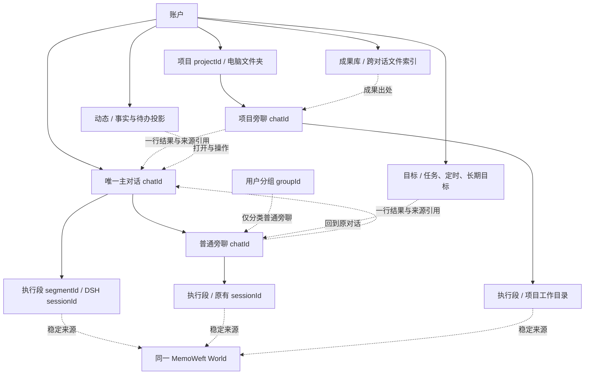
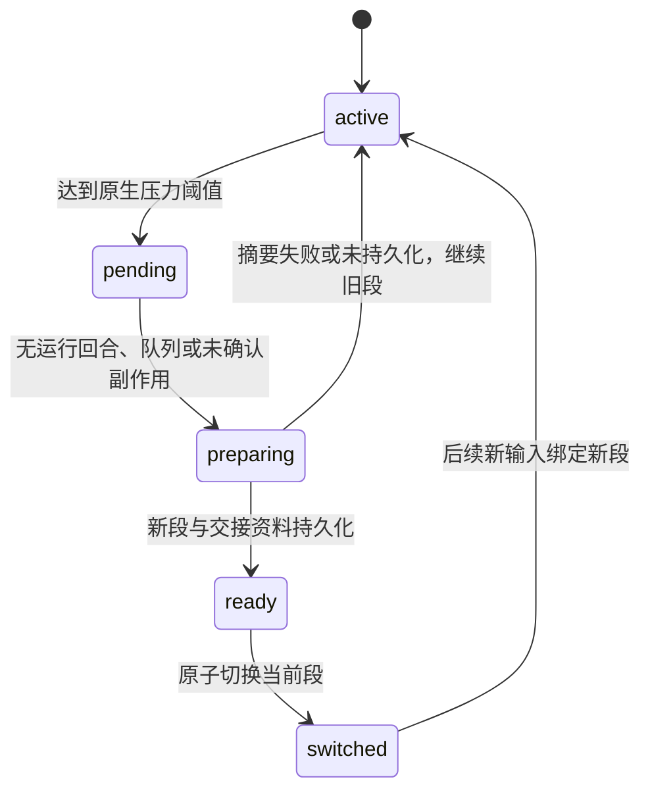

# IA-1 · 主对话、旁聊与四个固定入口

> 2026-10-09 · Windows-6 · **设计与契约草案，尚未实现**。依据 [PLAN](PLAN.md) D11 / D12 / D16 / D19 / D33–D37 / D42 / D43、9e / 9f，[VISION](VISION.md)、[UI_SPEC](UI_SPEC.md)、[CLIENT_API](CLIENT_API.md) 与 [COMPANION](COMPANION.md)。IA-2…IA-5、TB-1…TB-4 依本文实施；接口须随实现和验证再写入 CLIENT_API 正文。本包不改产品代码、不迁移真实数据。

## 1. 事实、范围与设计结论

### 1.1 已核对的底座

源码基线为 `c0d55347`。下列“已有”仅表示源码与契约存在，不代表本包重新做过运行验收。

| 事实与位置 | 对本设计的约束 |
|---|---|
| `src/personal-access/sessions.mjs`、`session-metadata.mjs`、`store.mjs` 已有账号归属、分组、归档、删除、原请求恢复；`commands.mjs` 以原生输入回执关联任务 | 保留 `sessionId`、`requestId`、`commandId`、`receiptId`；不能因改导航而重建旧会话 |
| CLIENT_API 3.3 / 3.4：列表没有分页；历史为 JSON（结构化数据）分页轮询，支持尾页、`beforeSeq`、`afterSeq`；旧 `afterSeq=-1` 从头读 | 主对话需要跨段接口，不能把单会话 `seq` 当全账户序号；文档中个别 SSE（服务端推送事件）旧措辞不作为新增推送协议的依据 |
| `src/runtime/dsh-adapter/sessions.mjs` 投影单会话历史，稳定水位可落后日志尾部；兼容读取分支会物化历史 | “接口只返回尾页”不等于冷启动没有全量读；IA-2 必须测量并补范围索引，不能只靠客户端虚拟滚动 |
| `session-lifecycle.mjs` 已有原生创建、恢复、空闲维护、独立工作目录、事件种子分叉 | D34 分叉复制历史和经验，继续保留；开旁聊另走摘要引用路径 |
| `tests/contract/dsh-pin.json` 与本地 `vendor/dsh-runtime/VENDOR-MANIFEST.json` 一致：`0.1.0-rc.5 @47f943859bef60e4160492346772ded9b24f765a` | 只依赖固定产物已核实的能力，不把共享源码的新接口默认为已打包 |
| 固定产物 `dsh-compaction/lib/types/index.d.ts` 与 `dsh-compaction-basic/lib/types/types.d.ts`：`compactIfNeeded`、`compactNow`、`compactRegion`；默认 `thresholdRatio=0.8`、`retainRatio=0.16`，可按模型覆盖 | 复用 compaction（上下文压缩）；压缩修改模型可见上下文并保留持久日志，不会自动创建本设计的下一执行段 |
| DSH 的 `compaction/summary`、检查点、`shadowedSeqs`，以及原生会话创建能力 | 宿主增加接力协调；不编造 `session.resume` 网络接口，不向 DSH 日志追加私有事件类型，不自写第二个摘要引擎 |
| `src/personal-memory/index.mjs` 已有 MF-1：优先 `preview_recall_batch`，近期未整理原话最多 4 条 / 900 字符，并与正式记忆共用预算 | 主对话换段不改变记忆形成边界；不用整条主对话代替召回 |
| `src/personal-access/schedules*.mjs` 与 CLIENT_API 3.18 已有 DSH schedule（定时调度）管理、通知、暂停 / 恢复 / 删除 / 立即运行 | 动态是现有事实的统一投影；目标页复用调度、任务和 goal（长期目标），不建第二个执行器 |
| `src/personal-access/resources.mjs` 已有按对话输出与来源；文件支持范围仍受成果接口限制 | 成果库做跨对话索引，格式扩展由 UX-5；不能承诺本包已可预览任意 Office（办公文档）文件 |

外部语义依据已只读核对 `MemoWeft/PROJECT-MAP.md`：一个稳定用户对应一个 World（记忆世界）；会话、项目、人格、模型和宿主只是 provenance（来源）与上下文。该地图中的历史实现状态不覆盖 WeftMate 当前源码事实。也已只看本机参考图 `mobile-2`、`mobile-10`、`codex-desktop-1`、`claude-desktop-sidebar`：借鉴主入口与旁聊的层级、紧凑固定导航和行内菜单；不复制图片、私人文字或品牌资产到公开仓库。

### 1.2 可直接实施的方向

1. 每账户一个稳定主对话。新增逻辑 `chatId`，下接一个或多个 DSH `sessionId`；`conversationId` 已用于同步 / 共享对话，**不复用这个字段**。
2. 旁聊的组织父级只有主对话或项目。项目对话就是父级为项目的旁聊；分组只是普通旁聊的列表分类。创建来源与组织父级分别保存。
3. 主对话按天显示，按上下文压力接力；日期分隔与执行段完全独立。历史不因接力删除，旧会话链接不改写。
4. 需要回应的事项在主对话可见；过程状态进动态。旁聊最终结果仍按 D42 在主对话留一行，所以它同时有动态索引，但不重复生成消息或通知。
5. 桌面固定入口为主对话、动态、目标、成果库；手机为聊天、动态、目标、成果库。任务详情仍在原对话；目标仅是总览与管理入口。D43 在这一点更新 UI_SPEC / D5 中旧的“没有任务列表”，保留“对话内执行”原则。

主对话能否批量清空 / 归档旧段属于尚未明确的产品取舍：**本轮建议不提供**，不阻塞上述结构。D33 已授权的按来源遗忘与可选原话删除继续适用。见第 8 节选项；实施方不得把本文草案视为批量删除数据授权。

## 2. 实体、身份与信息结构



| 实体 | 身份与关系 | 生命周期与约束 |
|---|---|---|
| 主对话 | `kind=main`，账户唯一 `mainChatId`；`parent=null`；头像代表 WeftMate / 精灵，不是用户头像 | 固定顶部、不可取消置顶、改名、归档、删除、移入项目或分组。可标未读；搜索、定位、D33 原话删除可用。未配置模型也可存在空主对话，首次发送才需要模型 |
| 普通旁聊 | `kind=side`，`parent={kind:main,id:mainChatId}`，`projectId=null`，可有 `groupId` | 继承 D34 置顶、未读、标题、分叉、归档、删除；独立工作目录与经验。日后可接力，IA-2 先实现主对话接力，旁聊原生压缩不受影响 |
| 项目旁聊 | `kind=side`，`parent={kind:project,id:projectId}`，`groupId=null` | D37 项目说明 / 权限 / 工作目录生效；置顶只在项目内部优先；移动空闲对话仅从下一回合生效。移除项目后父级回主对话，原文件与对话保留 |
| 分组 | 账户内 `groupId`，包含普通旁聊，无执行、模型或记忆权限含义 | 不嵌套；删除分组只移至未分组；主对话与项目旁聊不能加入 |
| 执行段 | `segmentId` → 唯一 `(hostId,sessionId)`；归属一个 `chatId`，有序号与接力引用 | 技术执行边界，不在侧栏当新旁聊显示。旧段可读，新的用户输入发当前段；旧任务、回执与来源仍绑定原段 |
| 开聊来源 | `originRefs[]` 指向 `(chatId,sessionId,seq,eventId)`；已有分叉的 `parentSessionId` 保留原义 | 从项目消息开到主对话下的旁聊时，来源仍指原项目；不据此继承项目写权限。移动旁聊不改来源 |
| 临时旁聊 | MEM-2 的 `memoryMode=off`，父级仍为主对话或项目 | 不形成，临时内容不进近期原话桥；可召回已有记忆，默认开启，召回开关独立。主对话本身不切临时模式。临时内容不自动回写主对话或全局成果库 |

`chatId` 只是导航与历史聚合身份，不能用它重写 MemoWeft 的旧来源会话 ID。所有新事件另附逻辑关系，原始 `(sessionId,seq)`、命令与回执仍是执行事实。主对话工作目录按逻辑对话保持稳定，跨段继续读同一份经验；普通旁聊有自己的目录。接力创建必须显式传该目录，不能沿用“每个新 session 建新目录”的默认行为。删某条原话不等于删除整个工作目录；主对话批量经验清理另待产品决定。

主对话、旁聊与项目都属于当前账户，用户在界面看见的不是可跨账号继承的树。M5 共享对话保留既有成员权限，不能因迁成“旁聊”而把共享内容写进个人主对话或扩大访问范围；共享回写留到 M5 明确授权范围。

## 3. 开旁聊与回到主对话

### 3.1 三个入口

| 入口 | 交互 | 带入内容 / 提交边界 |
|---|---|---|
| 消息菜单「从这里开旁聊」 | 完整消息可操作，正在流出的未完成回复暂不可选；小面板显示标题、归属、相关上下文摘要，可编辑第一句话 | 锚点截至选中消息，不带未来消息。先建旁聊，再由用户发送首句；原消息不在主对话再执行一次 |
| 输入区「开旁聊」 | 附件菜单中的独立动作；保留当前草稿，打开后转入新旁聊输入区 | 用户尚未发送的文字与附件保留为草稿；没有来源消息时不强行生成主对话摘要。点发送才登记任务 |
| 模型建议「单独开个旁聊来做」 | 在当前回复末尾给一个短建议及「开旁聊」动作，用户可继续留在主对话 | 复杂程度不是后台搬走用户任务的授权。已有“把这个另开旁聊做”等明确指令可直接创建；一般建议不创建会话、不启动重复任务、不改变审批模式 |

在旁聊消息上也可用同一入口：新旁聊与来源旁聊同属一个组织父级，不形成无限嵌套树。项目来源默认留在项目；跨父级须用户选目的地，已有权限照常检查。主对话输入区仍能直接办事，不强迫每项任务先开旁聊。

**上下文包**包括：用户目标、已明确约束、已确认决定、尚待回答的问题，以及相关原消息引用。建议初始预算为 `min(2,000 tokens, 目标模型上下文容量的 10%)`，tokens（模型文本单元）按实际测量；目标与限制优先，不足时标注摘要省略，并允许回原文。引用可跨少量相关消息，默认只围绕所选事项，不带主对话无关生活内容。附件保留授权引用和名称，不复制所有附件或整个工作目录。

利用原生摘要能力与已有消息读取接缝组织摘要；已有可用摘要就复用。没有摘要时允许先用用户首句和引用建聊，显示“相关上下文尚未带入”，由用户选择继续或重试；不假装已转移完整现场。摘要是 `source.kind=plugin` 的资料，不能当真人消息、授权凭据或新记忆证据。新旁聊首条可见信息显示“来自主对话 · 某日消息”，点开回定位；源消息后来删除则显示“原消息已删除”，不从摘要还原。

D34「分叉」继续表示原生完整事件种子 + 独立经验的副本，菜单文案解释差异。普通旁聊仍可分叉；主对话菜单只给“从这里开旁聊”，不提供会把无限历史全复制的整条主对话分叉。

### 3.2 结果回写

```text
主对话  [旁聊图标] 出游安排：已整理三种路线，待你选日期。  [打开]
                    10:42 · 待回应
```

- 一项根任务达到确定终态后产生一个 `side.result` 结果引用，稳定键为 `(sourceChatId,taskId,resultRevision)`；普通成功、失败、停止用真实状态写“一行摘要”，不把“停止”写成“完成”。闲聊不因每条回复都产生结果；用户点“发到主对话”可显式分享当前答复。
- 摘要优先取已完成可见答复的结论或结构化任务结果，最多 160 个显示字符，不再为每个完成事实调用模型。长内容、成果、步骤留在原对话。结果发生更正时更新同一结果版本关系，已读设备能收到更正，不叠出重复完成卡。
- 卡是引用投影；不伪造 DSH `assistant.message`，不启动主对话模型，不重复摄取原始记忆。下次真人对话需要该结果时才按来源读取并注入有界摘要。
- 回写与动态条目共享 `activityId` / `sourceRef`。主对话卡读到不等于批准，不等于任务结果被用户认可；“这项需要我回应”的状态只能随原任务事实变化。
- 普通 / 项目旁聊均回账户主对话；归档旁聊仍可产生在途任务结果，卡打开只读原对话。删除旁聊后清理派生摘要与搜索内容，卡可保留无正文的“旁聊已删除”占位以维持锚点。
- 临时旁聊不自动回写正文。显式“发到主对话”先说明该摘要将成为可记忆的普通对话内容，用户确认后仅分享选中的内容；共享对话不在本包自动回写。

## 4. 无限历史与执行接力

### 4.1 日期是显示边界，执行段是上下文边界

按账户 `timeZone`（时区）计算“今天 / 昨天 / YYYY 年 M 月 D 日”分隔条。一天可以有多个执行段，一个执行段也可跨天。午夜只插日期条，不强制开新会话、不产生虚构消息。存储时间为 UTC（协调世界时）；未设账户时区沿用现有宿主默认并返回实际时区，不能让不同设备各自猜测。同日长任务跨午夜仍保持步骤归属；日期条按条目时间显示，不把一个步骤拆为两个任务。

主对话初次打开取尾页，默认最近 50 个公开条目；保留向前与向后的独立游标。跳到日期查询该本地日的 UTC 范围，返回目标锚点和附近一页；无消息时返回“这天没有消息”和前 / 后有记录日期。定位后提供“回到最新”，新消息不把正在读历史的人拉到底部。修改时区重新分日与定位，不改事件 ID 和顺序。

### 4.2 接力状态与时机

触发信号使用原生 `contextPressure` 和当前模型有效容量，初值沿用原生 `thresholdRatio`（当前默认 80%）。达到阈值或发生压力压缩时记 `relayPending`；即使本轮原生压缩降下压力，也在下一安全边界接力。容量未知时不猜比例，继续原生压缩，不按消息数量强制切段。模型换成小窗口时重新测量，不能用费用累计 tokens 代替上下文占用。



接力步骤由宿主协调，摘要、会话生命周期和工具仍归 DSH：

1. 在账号事务队列内登记本次接力的旧段、目标段 ID、原生稳定水位与逻辑修订；允许读取历史。接力期间新发送持久登记，显示“排队中”，不要先发给两段再去重。
2. 必须原生回合结束、输入队列空、无待审批 / 待回答、无未确认命令 / 停止 / 后台 job（任务） / 活跃 goal（长期目标）。执行中仅由 DSH 自身压缩；停止用户任务不能作为换段手段。长期目标宜放旁聊，不能为了接力清掉原生目标。
3. 在原生空闲维护边界取得有效摘要。交接资料包含已有压缩摘要、摘要后仍有效的近期目标 / 决定、未完成事项引用、工作目录内经验索引、原模型与审批设置。必须覆盖摘要未包括的尾部，按原生 surface（模型可见上下文）顺序处理，不能把 `shadowedRange.start/end` 当连续数值范围。仅取安全摘要，不复制隐藏推理、旧召回包或所有历史事件。
4. 新建 DSH 会话，绑定同一主对话目录；通过现有插件注入交接资料，标记来源及覆盖水位。建议总注入目标不超过新模型窗口的 20%，含系统、工具、摘要和新输入后仍须通过原生预算测量；若未完成事项过多，只带索引与下一步，不静默丢目标。近期原话与正式记忆在下一真人输入时按正常规则召回。
5. 新段持久化并验证可恢复后，原子更新 `activeSegmentId`；旧段置 `sealed`。所有尚未派发新输入只在这一时刻绑定新段。已受理命令永久保留旧绑定，重试不能重新路由。
6. 崩溃恢复按已保存的阶段核对：未切换时旧段仍是唯一写入目标；已切换时继续新段；已创建未发布的新段留作恢复，不能重复建第二个。沿用原持久事务与命令恢复，不另建通用调度框架。

日常不显示“DSH 第几段”。较慢时仅显示“正在整理上下文”，用户可保留草稿并稍后重试。摘要失败不发布新段；旧段能继续则继续，原生也无法容纳时显示明确失败与“重试 / 开旁聊”，不循环静默重试。所有性能预算排除模型摘要耗时，并单独记录这项延迟。

**定时任务跨段**：未来定时触发不应永久阻塞接力。新建于主对话的规则以逻辑 `chatId` 为投递目的地，DSH 的规则管理身份 `(sessionId,id)` 保持稳定；触发时只通过原宿主命令入口绑定当时当前段。旧规则依旧投递旧旁聊，迁移不重复创建原生计时器。接力后若旧段仍有定时管理事件，作为该段的迟到变更投影到统一增量，不改历史序号。原生 goal 不跨段复制；未关闭时推迟接力。

### 4.3 分页、搜索、虚拟滚动

逻辑时间线是可重建索引，不是第二份 DSH 全文库：索引保存事件定位、展示顺序、日期、类型、变更修订及必要搜索文本；正文仍从原会话读取。新主对话卡等少量产品记录属于宿主数据，不能伪装成原生日志。索引冷构建后台渐进进行；新尾页可从当前段直接读，不能等历年全文索引完成才打开主对话。

- 新接口使用不透明 `cursor`（游标），封装段边界和稳定投影水位；客户端不能解析、加一或拼接它。条目有全局稳定 `eventId`，原生来源仍附 `(sessionId,seq)`。
- 历史顺序用宿主分配且不变的 `orderKey`，不是设备时间排序。段内先遵从原生顺序，离线晚交按接收顺序插入可识别区块，原发生时间另显示；不得因晚交重新排整个当前视口。
- 尾页返回独立 `syncCursor`；历史页只能更新历史边界，不能覆盖增量水位。增量为 `upserts` / `removals`，能表达旧段迟到结果、已读变更、遗忘清理。空页也可推进游标。
- 搜索范围固定为当前 `chatId` 的用户可见消息与结果摘要；支持文字、日期区间、角色、是否含成果。返回摘要命中、锚点与来源，不搜索隐藏推理 / 工具原始输出 / 被删除内容。工具详情仍按原接口按需读。中文子串 / 词法能力须有用例；语义搜索由 MEM-4 另包，不混在 IA-2。
- 虚拟滚动以稳定 ID 存展开、选择、焦点与高度；仅渲染视口附近 2–3 屏。上翻插入按首个可见 ID + 像素偏移保持位置；流式更新只改当前行，成果图片懒加载。建议内存保留约 500–1,000 条可见模型，磁盘缓存和分页边界另存，不把万条 DOM（文档对象树）常驻。
- 搜索定位可装载锚点前后两侧；被删除锚点返回相邻位置和删除提示。日期导航和全文索引重建显示 `indexState`，结果不完整时标“仍在整理历史”，不能显示为“没有记录”。

### 4.4 性能预算与测量

以下为实施验收目标，不是已测成绩。使用隔离账号、10,000 条可见消息 / 多段 / 混合步骤与成果夹具；设备、构建、页大小、网络时延和冷 / 热缓存写在证据里。冷启动历史与运行时恢复单独计时，不能只给暖缓存截图。

| 指标 | IA / TB 目标 | 测法 |
|---|---|---|
| 已启动程序打开主对话到首屏可读可输入 | Windows / Mac 本地 p95（第 95 百分位）≤1 秒；手机到宿主 RTT（往返时延）≤150 毫秒时 p95≤2 秒 | 30 次切入；不等待摘要、模型首字、全历史索引或整个旁聊列表 |
| 主对话尾页服务端读取 | 50 条 p95≤200 毫秒；历史增长十倍不线性增长 | 1 万 / 10 万条隔离数据比较；记录物理读取字节与扫描条数，覆盖冷进程 |
| 上翻 / 日期定位 | 本地已建索引 p95≤300 毫秒；客户端插入不跳行 | 跨 3 个执行段，上翻同时接收新消息 / 旧步骤完成 |
| 主对话内文字搜索 | 1 万条、已建索引 p95≤500 毫秒 | 中文短词、日期边界、无结果、删除后复查 |
| 万条消息滚动 | 60Hz 设备 p95 帧耗时≤20 毫秒；不出现持续 >100 毫秒主线程阻塞 | 连续滚动 60 秒，包含代码长行、图片、展开步骤与流式新消息；记录掉帧和最长阻塞 |
| 列表内存增量 | 1,000 → 10,000 条数据后，渲染器 / 原生时间线增量≤50MiB，挂载行数量有界 | 同一资源集，图片解码缓存单独列出；不以整台宿主内存替代时间线指标 |

## 5. 记忆、临时内容与遗忘

### 5.1 主对话内形成 / 召回节奏

真人消息与可摄取的可见回复在原生持久边界后继续交给 MemoWeft，按来源及 occurrence（经历记录）身份幂等摄取，**不等换天、压缩或换段**。摘要、召回注入、结果卡的再次展示不是新证据。后台形成与聊天走现有模型队列；Core（记忆核心）故障时普通聊天继续，恢复补交。

每个真人轮次依现有钩子召回一次，工具续步不重复查。MF-1 的近期原话与正式理解在同一快照去重，原话尚未形成时仍可跨段 / 旁聊桥接；“近期原话”不得冒称“已记住的事实”。当前回合、接力摘要、近期原话和正式记忆按来源 ID 去重，纠正优先。原生 compaction 处理短期上下文，MemoWeft 处理长期理解，不能用压缩摘要覆盖正式记忆。

MEM-2 按2026-10-10任务确认：关闭记忆停止摄取，临时原话不进入Evidence、形成与近期原话桥；已有记忆的正式召回与近期原话召回仍可用，默认开启，可独立关闭。仅隐藏“用到了 N 条记忆”标签不合格。关闭既有旁聊的记忆只影响后续使用，不自动遗忘过去，入口提供去记忆页查看来源。开启临时内容的普通模式只对确认后的新轮次生效，不追溯摄取；若要保留选中内容，通过显式分享产生新普通消息。主对话入口“这次别记”直接新建临时旁聊，避免一个长期主对话混合不透明的逐消息权限。

### 5.2 D33 在多段中的落地

| 操作 | 记录与经验 | 记忆与派生上下文 |
|---|---|---|
| 归档旁聊 | 原日志 / 文件 / 经验保留，恢复后可发送 | 记忆保留 |
| 删除旁聊，默认不勾遗忘 | 删除该逻辑旁聊全部执行段及其专属成果 / 目录；项目文件保留；来源链接可显示已删除 | 已形成长期记忆保留，按 D16 |
| 忘掉某项，默认不勾原话删除 | 用户可浏览的聊天原话保留 | Core 原话副本、关联记忆、召回缓存与派生摘要真正清除；保留的旧原文不能自动重新摄取或带回后续上下文 |
| 忘掉某项并勾原话删除 | 删除来源所覆盖的具体片段，可能横跨主对话多段 / 旁聊，不删整个主对话实体 | 同上；结果卡、交接摘要、检索索引、离线副本同步失效 |
| 主对话“清空 / 归档旧段” | 本轮无此入口 | 不用“清空上下文”替代删除或遗忘 |

先做现有只读遗忘预览，聚合逻辑对话所有原始 `sessionId` 的来源，列出同句派生的人物 / 关系 / 评价、涉及对话与片段数量，并附 `worldRevision`（记忆修订）及逻辑内容修订。原话删除默认不勾；修订变化重新预览。操作沿用原请求身份与 Core 回执，失败不宣称完成。

IA-2 必须扩展现有 `memory-erasure.mjs` 清理接缝：沿原始来源标识追到新交接摘要、开旁聊摘要、结果投影和索引，失效后重新生成无被忘来源的摘要；不能只删原段日志而让新段摘要把它带回来。若混合摘要无法安全定位，整份弃用而非保留敏感片段；原文保留仅供用户浏览，后续模型与自动形成须过滤已遗忘来源。当前运行需要清理时沿用现有忙碌 / 等待语义，完成清理前不允许带旧摘要开启下一轮。

客户端消费清理变更后移除缓存正文和搜索命中；M3-A 的加密只读副本更新同一删除水位。离线设备尚未获知遗忘时不能声称它已清理；重连先应用撤权 / 遗忘，再补交离线形成，阻止旧来源复活。已导出的用户文件和过去备份可能仍含原话，沿 CLIENT_API 的既有边界说明；本设计不承诺远程擦除不可达副本。

## 6. 主动消息与四页信息结构

### 6.1 落点、通知与去重

主对话负责相处与需要回应的交流；动态负责“发生了什么 / 有什么待处理”。同一个事实允许有两处入口，但正文、任务身份、可操作状态与通知只认同一个来源。`requiresResponse` 来自原审批 / 提问 / 明确需选择的结果，不能只因模型写了问号就升级为强提醒。

| 事实 | 主对话 | 动态 | 通知及原动作 |
|---|---|---|---|
| 用户明确设置的提醒 | 主对话新建的提醒按 D42 显示；旧规则仍留原对话，迁移不双发 | `reminder.due`，显示到期时间、迟到标识 | 受提醒类别与勿扰控制；点击打开来源。推迟操作需 TB-2 原生规则支持后才显示 |
| 旁聊任务完成 / 失败 / 停止 | 一行 `side.result`，来自 D42；需选择时显示待回应 | `task.completed / failed / stopped` | 同一终态只通知一次；进入原旁聊查看，不在动态重建步骤列表 |
| 主对话内任务完成 | 原回复 / 成果就是完成信息，不另插一张相同卡 | 同一任务的完成条目 | 无重复主对话消息 |
| 待审批 / 待回答 | 原任务在主对话则直接用 D35 输入区条；旁聊则显示来源引用，点击进入原对话 | `approval.requested / question.asked`；可内联处理审批，回答用原问题表单 | 必须复用原 `approvalId/questionId` 和请求回执；永不因已读自动批准。手表可从主对话引用处理同一审批 |
| 排队、开始、一般进度 | 只在执行的原对话更新，不主动插主对话消息 | 更新已有任务条目 / 目标页状态，默认不每步新增一行 | 不系统通知，不计主动打扰次数 |
| 精灵问候、明确关心与邀请交流 | D42 的主对话消息，受 D19 活跃度控制 | 同一 `companion.message` 的索引，可点回 | 不复制为两个模型回复；主对话头像表达状态，普通变化不主动打扰 |
| 精灵状态变化 / 健康摘要 | 无需回应时不新发主对话正文 | `companion.state / health.summary`，按日聚合 | 尊重已有健康数据授权与模型范围；不在推送正文暴露健康细节 |
| 记忆周报 | 默认不进主对话，用户点“聊聊这件事”再引用 | `memory.weekly`，查看 / 纠正 / 忘掉 | 遗忘仍走 D33 预览确认，不做无确认的快捷删除 |

ST-6 管的是通知与主动出现，不删除事实、不停任务、不藏审批。读取原对话 / 动态永远能看到真实待处理项。规则次序：账号及设备授权 → 类别开关 → 本设备覆盖 / 勿扰 → 主动打扰预算 → 原平台通知。默认不擅自设置夜间勿扰；沿 COMPANION 的默认中活跃度，关闭精灵仍保留任务审批 / 回答能力。

每日上限仅统计未受用户直接请求的问候 / 建议 / 主动健康关心；用户设的提醒、任务结果和等待用户的审批按各自类型开关管理，不占这项主动预算。勿扰期间不发声音 / 震动；不擅自给审批开绕过勿扰特权，应用内待办仍在。主动上限达到后，状态类留在动态，过时问候丢弃，不在次日积压连发。勿扰结束只汇总仍有意义的未处理事项。ST-6 可另让用户显式配置例外。

同一 `activityId` 在主对话、动态、推送和手表之间关联；按该事实的通知版本在每设备去重，不能拿“每次轮询返回”作为再次通知理由。账户主动预算按事实计一次，各设备仍可依覆盖设置选择是否提示。前台已在源对话读到结果时，本设备不另弹系统通知。

### 6.2 页面与旧入口去留

| 页 / 入口 | 信息层级和主要动作 | 空状态 / 迁移 |
|---|---|---|
| 聊天 | 默认进入主对话；标题旁搜索 / 跳日期 / 更多，消息流、输入区；“对话”抽屉列主对话、置顶旁聊、分组 / 未分组、项目。桌面同一层级常驻侧栏 | “想聊什么，或有什么想让我做？”及正常输入框；无模型时一行配置入口；不自动导入旧对话全文当欢迎消息 |
| 动态 | 顶部“待处理 / 全部”与未读筛选；待处理按发生时间稳定显示，其后按天反序；条目含来源、时间、简短内容、状态、就地动作 | “暂时没有新动态。提醒和任务结果会出现在这里。”有失败则显示重试，不能用空态掩盖请求错误 |
| 目标 | 三组：进行中任务（含排队 / 等待你 / 停止核对中）；定时任务（下次时间、规则、暂停）；长期目标（目标、真实状态、最近进展、来源旁聊） | “还没有进行中的任务” + “回主对话交代一件事”；定时任务给“新建”；长期目标给“描述一个目标”。不能把所有普通聊天自动变长期目标 |
| 成果库 | 跨对话文件列表；搜索名称，按项目 / 类型筛选；行含文件名、类型、大小、生成时间、出处、核验状态；打开、下载 / 分享、桌面在文件夹中显示 | “生成的文件会保存在这里” + “回主对话”；某筛选为空给“清除筛选”；文件已不存在单独显示不可用与出处 |
| 设置 → 已归档 | 保留 D34 的标题搜索、恢复、删除，显示旁聊归属 | 不回侧栏；主对话不混入已归档 |
| 项目 | 仍在聊天列表中，电脑新建 / 编辑 / 移除；目标和成果库仅按项目筛选 | 原“项目与成果”项目登记入口合并到这里；旧链接跳对应项目，不新建第二份项目 |
| 提醒与定时任务旧页 | 管理内容合并到目标 → 定时任务；设置只保留通知偏好 | 旧路由跳转并选中目标子区；新建 / 编辑展示当地时间、重复规则、执行对话与模式，保存复用 DSH |
| 输出与来源 | 保留当前对话的轻浮层与右侧多标签面板 / 手机全屏预览 | “输出”来自成果库同一索引按 `chatId` 过滤；“来源”仍属于本对话，不把读过的每个网页放成果库 |
| 记忆、健康、设备、精灵设置 | 沿已有设置与头像入口 | 不新增第五个选项卡；M4 精灵家园由主对话头像 / 动态相关项进入 |

“目标”中的停止直接调用原 `/tasks/{id}/stop`，不新造“目标停止”命令；待核对、已停止和可续做依实际回执显示。长期 goal 与一次根任务是不同对象：一个长期目标可有多轮任务，进度仅用原生已报告事实，不凭空计算百分比。原生 goal 属于具体会话，第一版一个可续跑旁聊承载一个当前目标；新目标入口把描述交给用户选择的旁聊，不把主对话长期锁在后台续跑。目标暂停与当前任务停止分别标注，不能相互冒充。

成果库中的项目归属默认记录**产出时项目**；移动对话不让旧文件“搬家”，另展示当前来源对话。去重键使用 `artifactId` 和实际版本，不按同名或相同文件哈希合并不同会话所有权。归档仍保留成果；删除对话按现契约删除宿主生成副本，项目目录原文件不删除。分享是用户主动系统分享 / 下载，不自动创建公开网址或发布到服务器；临时对话成果不进全局库，显式“保存到成果库”才持久保留，并说明将离开临时范围。

### 6.3 动态事件模型与已读

动态条目是 `Activity`，有稳定 `id`、`revision`、类型、发生 / 更新时间、`sourceRef`、标题 / 摘要、`state`、`requiresResponse`、`actions[]`、`readAt`。原事实以原生事件 / 命令终态 / 提醒 ID / 周报 ID 为去重键。待审批被其他端处理后更新原条目为已处理，不能另留可点击的“批准”。源对象删除后移除正文和危险动作，保留无正文占位或返回删除变更。

已读属于账户，同步到各端；只在条目实际进入视口并停留约 1 秒、或用户主动“标为已读”时写入。仅打开动态页不把未加载的全部历史标已读。“全部已读”限定本次看到的快照水位；晚到的新条目仍未读。标未读是显示偏好，不能恢复已处理审批。正文 / 决定发生实质更正时升 `attentionRevision` 并重新未读；纯进度更新时间不反复打扰。

动态未读数、聊天未读数和待审批数分别派生，不相加成伪造的“新消息数”。从主对话读到某结果可以同步该动态条目的已读水位；打开动态不将整个来源旁聊标已读。操作前重新取原事实状态；多端同时答复返回已有回执 / 冲突并更新展示，不能请求第二次授权来“覆盖”。

## 7. 五端线框与状态边界

### 7.1 共用结构与视觉约束

沿用 `design/tokens/`、`design/icons/` 与 UI_SPEC 的浅 / 深色、字号、右侧面板、D35 灰字步骤与输入区审批条。此包属于现有界面的结构扩展，不另造品牌或新主题。所有示意文字均为合成例子。四个入口有图标和文字，未读之外不常亮状态灯；选中态不能只靠颜色。

```text
Windows 程序（Electron） / Mac 原生应用
┌──────────────────┬────────────────────────────┬─────────────────┐
│ [头像] 主对话     │ WeftMate       搜索 日期 ⋯ │ 输出与来源      │
│ 动态  · 2        │ ── 今天 ──                 │ [路线.md] [来源]│
│ 目标             │ 本人：周末怎么安排？        │                 │
│ 成果库           │ 助手回复 / 灰字步骤         │ 预览内容        │
│ ───────────────  │ 旁聊结果：路线已整理 [打开] │                 │
│ 旁聊     [+] 搜索│                            │                 │
│   置顶 / 分组    │                            │                 │
│ 项目             │ 需批准时：审批条            │                 │
│   出游计划   [+] │ [附件  输入内容         发] │                 │
│ [本人头像] 设置  │ 模型 / 审批模式             │                 │
└──────────────────┴────────────────────────────┴─────────────────┘
```

**Windows（视窗系统）**：真实 Electron（桌面程序框架）窗口为主，侧栏固定入口不随旁聊滚出；折叠后保留可访问名称的入口。`Ctrl+N` 新旁聊、`Ctrl+K` 沿全局搜索、主对话内搜索用标题按钮；项目 / 旁聊行悬停菜单继续 D34。窄窗收右侧面板后再收侧栏，不能挤没审批动作。程序成果可默认应用打开 / 定位，远程浏览器仅给浏览器可用动作。

**macOS（苹果电脑系统）**：同一信息顺序，使用原生侧栏 / 分栏、`Cmd` 快捷键和文件选择；窗口恢复记住当前页面及锚点。Mac 作为执行宿主是 M3-3，IA-5 不以导航上线冒充本地工具可用。远连其他电脑时仍按当前项目权限呈现。

```text
Android / iPhone / 手机远程网页
┌─────────────────────────┐
│ 对话  [精灵] WeftMate  [本人头像]│
│        今天       搜索 ⋯ │
│ 用户消息                 │
│ 助手回复                 │
│ 旁聊：路线已整理  [打开] │
│                         │
│ [批准条，出现时占位]     │
│ [+  输入内容         发] │
│ 聊天 | 动态· | 目标 | 成果库 │
└─────────────────────────┘
```

**Android（安卓）**：共享手机界面包装入现有原生壳，业务层使用统一 `/personal/v1`。聊天首次进入主对话；标题“对话”打开旁聊 / 项目抽屉，旁聊标题有“回主对话”动作。系统返回顺序是预览 → 详情 / 抽屉 → 所在页，不退出正在执行的任务。原生桥升级最低版本由 IA-4 / TB-4 按实际桥能力声明，不猜沿用 code23。

**iPhone（苹果手机）**：原生底部四选项卡，每页保留滚动与筛选，聊天保留草稿 / 所在旁聊；首次打开聊天进入主对话，再次点已选“聊天”回主对话，仍不丢旁聊草稿。原生返回手势恢复来源列表锚点；动态审批调用同一原接口，审批结果同步到原对话输入条。头像进入统一设置，精灵头像负责同一助手形象，二者位置与可访问标签明确区分。

手机输入键盘弹出时隐藏底部选项卡，输入区随键盘上沿，收键盘恢复原页；预览全屏时暂时隐藏导航，关闭回原锚点。保留系统安全区和至少 44pt / 48dp 的触控目标（平台原生尺寸单位）；长中文标题允许两行或省略配完整可访问名称。字体放大后动作可换行，不能遮住发送 / 批准。减少动态效果时无必要滚动动画；读屏聚焦消息或审批动作，加载更早历史后不把焦点送回页首。

```text
Apple Watch（苹果手表）
┌────────────────────┐
│ [精灵] WeftMate     │
│ 待审批 1 / 完成 2  │
│ 出游计划：要保存文件│
│ [详情]             │
│ [批准] [拒绝]      │
│ 完成：路线已整理   │
│ [在手机打开]       │
└────────────────────┘
```

**Watch**：此包只取主对话中审批引用与完成结果的筛选投影，不加载整条主对话 / 旁聊列表 / 四选项卡。已存在的健康与精灵入口仍保留。批准 / 拒绝通过既有 PhoneWatchTimelineBridge（手机手表时间线桥）传给原审批，不在手表创造新审批。需完整风险说明且小屏无法展示时“在手机处理”；手机不可达显示缓存时间和“连接手机后处理”，不离线假批准。跨端处理后及时移除待批动作，完成可依 ST-6 震动。

### 7.2 M3-A 离线与跨宿主衔接

“电脑离线”与“手机无网络”分开：电脑离线但手机联网且用户已配置 / 允许云模型时，可用授权的加密只读记忆副本聊天；手机无网络只能看缓存与保存草稿，不能声称云模型在运行。主对话始终保留同一个 `chatId`，离线分支仅是待同步内容，不另生第二个主对话。

离线消息沿 M3-A / 既有同步日志使用设备稳定事件 ID、设备内序号、原始时间和最后宿主水位。界面标“电脑离线，可聊天；电脑任务待上线”，输入区不每条重复说明。可见历史缺口显示“更早记录需连接电脑”；只在本地缓存搜索，并明确范围。离线不允许审批、停止、项目写入、创建电脑定时器；用户操作保留为待提交意图，S7 可用后才显示“已排队”，否则只叫“已存为草稿”。

重连先核对未确认命令原 `requestId`，再同步离线聊天与删除水位；只合并已完成的聊天回合，不把离线用户输入再执行一遍。两台手机并发离线对话保留两组来源，按接收区块追加，原发生时间可见；不按设备钟覆盖在线消息。DSH 上下文只导入有界续接摘要；原离线全文仍由同步历史定位读取。形成按原事件身份补交一次，临时回合不补交。离线里被存为“电脑任务”的显式意图只有 S7 独立命令领取才执行。

多宿主阶段由 M3-4 决定账户唯一主对话的权威宿主与路由修订，IA-2 先以当前账号原宿主为权威。新增 Mac 宿主不能自行以相同云账号生成另一份主对话；无权威映射时保留本机模式并等待路由接入，不进行跨机猜测合并。本机账号绑定云账号沿现有身份映射保留 `mainChatId`，不能用可变邮箱派生 ID。

### 7.3 状态与边界情况表

| 情况 | 用户看见 / 可做 | 宿主与客户端处理 / 验收 |
|---|---|---|
| 全新账号、模型未配置 | 空主对话 + 配置模型 | 唯一逻辑身份已存在，无虚构历史；配完后首发只建一段 |
| 两端同时首次打开 / 发消息 | 同一主对话，两条输入顺序稳定 | 账户唯一绑定 + 原请求幂等；按服务端顺序入队 |
| 主对话在运行时开旁聊 | 可从已完成消息创建；原任务继续 | 未完成流式尾部不纳入摘要；两项任务身份不同 |
| 接力时收到新输入 / 崩溃 | 新输入排队，可核对原请求 | 新段发布前不发送；重启只有一个当前段，不重做已接受消息 |
| 接力摘要失败 / 模型太小 | 原对话仍在，失败说明与下一动作 | 不发布空摘要新段，不删除旧段；不能捏造剩余容量 |
| 审批在另一端已处理 | 当前条更新“已在其他设备处理” | 同一回执；过期动作不可再次生效 |
| 归档仍在运行的旁聊 | 归档列表可看结果，恢复后再发 | 沿现有归档不停止运行语义；回写主对话不自动取消归档 |
| 删除旁聊 / 运行或形成未确认 | 确认范围，失败可重试 | 沿现契约先核对停止 / 形成；不能只删导航行报成功 |
| 上翻时新消息 / 新结果到达 | 锚点不跳，“有新消息” | 历史和增量游标分开，步骤完成就地合并 |
| 删除 / 遗忘后用旧深链打开 | 无正文占位 / 相邻消息 | 不能从搜索、缓存、回执正文或结果摘要恢复被清内容 |
| 切时区 / 夏令时重叠日 | 日期按账户时区重算 | 原事件身份不变，跳日期用真实日界，支持 23 / 25 小时 |
| 项目被移除 / 旁聊被移动 | 原历史保留，下回合目录提示 | 不复制 / 删除项目文件，不挪旧成果归属 |
| 动态已读但审批未处理 | 待处理仍在，不显示为完成 | 已读与行动状态分离，角标可独立显示 |
| 临时旁聊完成 / 自动过期 | 私有结果留原旁聊，过期不可访问 | 不泄漏到主对话、动态正文、全局检索或成果库；操作到期失败可解释 |
| 旧客户端连接新版宿主 | 旧会话可读可发，提示更新获得主对话 | 不把旧会话链接转到新主对话；未支持能力不发未知控制字段 |
| 离线批准 / 断网后的发送未知 | 保留草稿 / 未确认状态 | 不假装批准，按原请求核对，不把重连当新发送 |
| 未知动态类型 / 成果格式不支持 | 通用摘要 + 打开来源 / 下载 | 不崩溃，不出现不可用的假操作 |

## 8. 升级、兼容与回滚

### 8.1 数据迁移顺序

1. 在现有 BK-1 升级快照与写入队列边界取得可恢复备份；仅使用隔离副本演练。本包不运行迁移。
2. 按稳定账户身份幂等分配唯一 `mainChatId`，空主对话不选择“最近会话”冒充。先写新逻辑元数据与迁移修订，DSH 日志、命令表、回执和文件不重写。
3. 每个已有顶层、用户可见会话建立一对一旁聊映射。项目绑定保留父项目；普通 / 浏览器任务会话父级为主对话；分组、置顶、标题、已读、归档、模型、审批、工作目录均保留。内部子任务不变成旁聊；共享 / 同步 `conversationId` 只增关系映射，权限和采集规则不变。
4. 为每个已迁会话建立首个 `segmentId` 与旧地址映射；校验会话 / 命令 / 附件 / 成果数量及绑定。不回放用户命令，不重新摄取记忆，不为历史完成任务批量刷出主对话结果或系统通知。
5. 发布新结构能力后才让新界面取 `/chats/main`；逐步建立日期 / 搜索 / 成果索引。主对话第一次真人发送创建首个执行段，原旁聊可以继续原任务。
6. 旧客户端此后新建的 `session.create` 在新宿主上同时登记旁聊关系；旧客户端移动 / 归档 / 删除要同步更新逻辑元数据，不能出现两个相互矛盾的列表。新元数据读取从同一会话 / 项目事实投影，不双写两套可独立修改的标题或权限。

迁移写入沿现有私有存储和原子替换；只增加本功能所需迁移阶段，不建通用审计框架。中途崩溃从最后已提交阶段继续；未发布的逻辑关系对客户端不可见。主对话与旧会话内容不相互拷贝。原深链携带 `sessionId` 时解析到对应旁聊 / 执行段并定位原 `seq`；旧 HTTP（网络接口）仍按旧身份读取原日志。

### 8.2 客户端与宿主版本矩阵

| 组合 | 行为 |
|---|---|
| 新客户端 + 新宿主 | 按能力打开唯一主对话、逻辑历史及四入口；子能力各自协商 |
| 新客户端 + 旧宿主 | 沿原会话列表与旧历史；显示一次可更新提示，不在客户端私造主对话；未支持的动态 / 目标能力明确不可用 |
| 旧客户端 + 新宿主 | 保持 `/sessions`、旧命令、旧历史分页、旧成果下载 / 深链。主对话执行段不塞进旧列表成为几十个新会话；因此旧客户端暂不能阅读新的主对话聚合内容，须更新，原内容完整可用 |
| 旧客户端持有主对话段 ID | 可按既有授权只读历史 / 已有回执；主对话生命周期动作由服务端拒绝。不能删除、归档或把已封段重新当普通会话发送；返回可理解的冲突及升级提示 |
| 新手机界面 + 旧原生桥 | 更新清单的最低原生版本挡住不兼容资源；不靠请求失败后无限重试 |

主对话保护必须在宿主而不只是菜单；已存在旧旁聊完全保持原 API（应用编程接口）语义。主对话段的附件和已登记原任务控制仍按原身份核对。能力协商独立于版本字符串，不能因主对话可用就假设动态或离线能力可用。

### 8.3 出错回滚

- **界面回滚**：关闭新入口恢复旧 UI（界面），不删新数据；用户可继续旧旁聊，主对话新内容保留给兼容版本恢复读取。D32 签名与最低版本规则照常适用。
- **接力失败**：当前段指针未发布则继续旧段；已经发布则恢复新段。不能同时让两段接收新主对话命令。旧段只保留历史与原定时管理身份，不逆向复制新消息制造双回执。
- **迁移未发布失败**：忽略未完成映射，保留原存储，修复后重跑；已有读取与旧客户端工作不受影响。物理日志和旧字段未重写使这一回退可行。
- **新版已产生数据后宿主降级**：不承诺旧二进制可直接读新版 schema（存储结构）。优先回到保留新存储适配的兼容宿主；若必须降到完全旧版本，停写并保存新版完整快照，恢复旧快照到独立目录，新数据保留待前向恢复 / 导出。不能覆盖升级后的日用目录；不能在两份目录同时执行相同任务。程序降级不会撤销真实外部操作。
- 已发生的 D33 遗忘不能因回滚复活。前向恢复必须先重放遗忘 / 撤权水位；备份中确有旧内容时沿 BK-1 既有恢复说明处理，不能自动恢复后立即重新摄取。

### 8.4 留给本人选择、暂不阻塞的取舍

| 问题 | 选项 | 本文建议与本轮默认 |
|---|---|---|
| 主对话旧内容如何整理 | A：只折叠 / 搜索定位；B：归档旧日期区间、可恢复；C：永久清空区间并选择是否遗忘 | **A**。接力解决模型和性能，日期 / 搜索解决导航。B 需定义搜索默认范围；C 需定义经验与成果删除范围。IA-2…IA-5 不实现 B / C；D33 按来源遗忘与可选片段删除照常实现 |

旧客户端不能用旧会话接口得到跨段主对话，是明确的兼容能力边界，非数据丢失；增加独立新接口避免改变旧 `seq` 与回执含义。没有新增权限、付费服务、部署或用户数据清理的隐含授权。默认方案可继续实施，未定选项保留在 PR（拉取请求）与交付回执中，不等待本人在线。

## 9. 附录：CLIENT_API 变更草案

### 9.1 通用约定与能力协商

**以下路径、字段和错误均为提案，不能当作现有接口调用。** 路径省略 `/personal/v1`。现有认证、账号隔离、设备撤权、Origin（请求来源）、CSRF（跨站请求伪造防护）、响应脱敏和请求体限制继续适用。读取需 `sessions:read`、普通写需 `commands:write`、记忆变更仍需 Cookie（会话凭据）与 `account:manage`；无新增权限范围。

`GET /status` 新增可选 `personalCapabilities`，每项缺失等于不支持，`0` / 未识别版本也不得调用：

```json
{
  "personalCapabilities": {
    "chats": 1,
    "chatTimeline": 1,
    "chatSearch": 1,
    "sideChats": 1,
    "activity": 1,
    "taskOverview": 1,
    "scheduleEditing": 1,
    "goals": 1,
    "artifactLibrary": 1
  }
}
```

示例展示最终组合，不表示 IA-2 一次声明全部。MEM-2 的 `temporaryChats`、M3-A 的 `offlineMainChat` 由对应包验证后添加。新客户端只接受自身支持的版本；只读降级不猜测新动作。旧客户端可忽略响应新字段，旧宿主拒绝未知请求键，因此新写入字段必须先查能力。

新增持久写入统一带 `requestId`；同 ID 同请求返回同一结果，不同请求 409 `REQUEST_CONFLICT`。普通短写返回 200 / 201，响应不确定时用原体原 ID 重放该接口，成功结果先于修订冲突检查；`/commands` 接受的命令才通过原命令查询端点核对。需摘要、记忆或原生异步受理的工作用现有 `/commands` 或记忆回执流程，不引入第二套长任务回执服务。需要比较修订的写入额外带 `expectedRevision`，冲突返回 409 `REVISION_CHANGED`；不得给新编号重发同一意图。

### 9.2 逻辑对话对象与生命周期

```json
{
  "chatId": "chat-main-example",
  "kind": "main",
  "title": "WeftMate",
  "parent": null,
  "pinned": true,
  "archived": false,
  "unread": true,
  "groupId": null,
  "memoryMode": "on",
  "activeSegmentId": "segment-example",
  "activeSessionId": "session-example",
  "revision": 3,
  "contentRevision": 1,
  "timeZone": "Asia/Shanghai",
  "sendAvailable": true,
  "taskAvailable": true
}
```

未创建原生执行段时两个 active 字段为 `null`。`revision` 用于元数据 / 路由并发；`contentRevision` 用于删除 / 遗忘后的缓存失效，不因每条新消息都强制整页重置。`projectId`、`projectName`、`modelProfileId`、`processing`、`contextUsage`、`running` 按原事实投影；`originRefs` 仅在旁聊存在，`parentSessionId` 继续表示旧分叉谱系。执行段 `{segmentId,chatId,ordinal,hostId,sessionId,state,startedAt,sealedAt?,handoffSourceRefs?}` 的摘要正文只在宿主，不默认返回客户端。

| 新 / 修改接口 | 请求 | 响应与语义 | 实施 |
|---|---|---|---|
| GET `/chats/main` | 无 | 200 `{chat}`；取迁移或账号初始化时已建立的唯一主对话，不因 GET 创建多个 DSH 会话；初始化未完成 503 `CHAT_INITIALIZING` | IA-2 |
| GET `/chats` | `kind=side`、`parentKind=main\|project`、`parentId`、`archived=false\|true\|all`、`q`、`cursor`、`limit`；均可选，默认活动旁聊 50 条 | `{items,nextCursor,hasMore,groups,indexState}`；置顶在父级内优先，默认按最近活动，稳定 ID 打破同时间并列。游标固定该页快照；`q` 只搜标题。项目仍 GET `/projects` | IA-2 |
| GET `/chats/{chatId}` | 无 | `{chat}`；账号内查找；不存在 404 `CHAT_UNAVAILABLE` | IA-2 |
| GET `/sessions/{sessionId}/chat` | 无 | `{chatId,segmentId,archived,kind}`；旧深链转逻辑对话，旧 history（历史）本身不重定向 | IA-2 |
| PATCH `/chats/{chatId}/metadata` | `requestId,expectedRevision` + 原 `title,pinned,unread,groupId,projectId` | 200 `{chat}`；复用原权限 / 项目 / 分组校验和修订；主对话只允许已读偏好，其他生命周期字段 409 `MAIN_CHAT_PROTECTED` | IA-2 |
| POST `/chats/{chatId}/archive` 或 `/unarchive` | `requestId,expectedRevision` | 200 `{chat}`；仅旁聊，所有执行段保持一致；运行行为沿现契约 | IA-2 |
| GET `/chats/{chatId}/forget-preview` | 无 | 200 现有预览结构加 `chatId,contentRevision,sessionCount,snippetCount`；聚合原段来源去重，不以主对话 ID 查询空来源 | IA-2 |
| DELETE `/chats/{chatId}` | `requestId,expectedRevision,forgetMemories=false,deleteConversationSnippets=false,memoryWorldRevision?` | 200 `{chatId,deleted:true,...}`；仅旁聊，删除覆盖全部段；Core 清理未确认仍失败并可原请求重试。主对话 409 `MAIN_CHAT_PROTECTED` | IA-2 |
| GET `/chats/{chatId}/resources` | `cursor,limit` | 当前逻辑对话跨段的 `{outputs,sources,nextCursor,hasMore}`；输出 / 来源形状复用原接口 | IA-2，TB-3 接全局索引 |

列表 `limit` 默认 50，范围 1–200，继承已有有界分页约定。旧 `/sessions` 不加语义重载，无需旧客户端传新参数。旧分组接口继续有效，不另造“主对话分组”。旧 `/sessions/{id}/metadata|archive|delete` 对原一段旁聊仍有效，并在同一事务更新逻辑关系。IA-2 不给旁聊启用多段接力，因此本轮无“旧客户端只删掉多段旁聊一段”的歧义；未来启用前须扩展兼容策略。

### 9.3 开旁聊、发送与结果

扩展现有 `POST /commands`，仍必填 `requestId,kind,targetDeviceId`；回执查询继续 `/commands/by-request/{requestId}`。下列示例没有凭据或真实内容。

```json
{
  "requestId": "side-create-example",
  "kind": "session.side.create",
  "targetDeviceId": "host-example",
  "parent": {"kind": "main", "id": "chat-main-example"},
  "originChatId": "chat-main-example",
  "originEventId": "event-example",
  "modelProfileId": "local",
  "title": "出游安排"
}
```

创建必须给 `parent`、`modelProfileId`；`originChatId/originEventId` 同时出现或同时省略，标题可选。客户端只给锚点，摘要由宿主授权读取，不能把任意客户端“摘要”当原消息事实。成功受理返回 202 `{command}`，命令含预分配 `chatId,sessionId`；真实可用前不能发送。附 `contextTransfer:{state:ready|references_only|failed,sourceRefs,summary?,truncated}` 供建聊面板呈现；引用不可读 404 `SOURCE_UNAVAILABLE`，临时内容越界 409 `TEMPORARY_CONTEXT_CONFIRMATION_REQUIRED`。该创建命令不代表执行首个用户任务。输入草稿和附件暂存仍由客户端保留，建好后按原附件路径上传。

`session.message` 新增 `chatId`，与 `sessionId` **恰好选一个**。`chatId` 用于新客户端发逻辑对话；首次主对话尚无执行段时可额外传 `modelProfileId`，未给则使用已配置默认模型，均无则 422 `MODEL_UNAVAILABLE`。已有段的模型选择仍按现有模型能力处理，不能借此字段偷换运行中模型。`intent`、旧 `mode`、附件等沿原规则。

宿主持久保存原请求体的身份，再串行解析当前执行段；解析后 `Command` 附 `chatId,segmentId,sessionId`，只绑定一次。接力窗口内的已登记命令可暂未绑定 `sessionId`，客户端依据原请求查询；不把响应里暂缺字段视为可用。`targetDeviceId` 仍是权威宿主 ID，跨宿主派发交 M3-4，不把 `chatId` 当执行位置。

旧 `session.message` 以普通旁聊 `sessionId` 发送保持原义。直接用主对话内部段 ID 发新消息返回 409 `MAIN_CHAT_ROUTE_REQUIRED`，要求支持新能力的客户端按 `chatId` 发送；已登记原请求的核对 / 重试优先返回原回执，不因此被拒绝。旧主对话段的归档、删除、分叉和组织移动均返回 `MAIN_CHAT_PROTECTED`；已有原任务控制仍用原任务身份。

按 `chatId` 发送的待上传附件需要先读取当前段或由宿主在同一创建 / 上传请求中返回绑定；建议 IA-2 新增 `PUT /chats/{chatId}/attachments/{attachmentId}`，参数 / 五项元数据与原会话上传相同，按 `(chatId,requestId)` 暂存，最终命令绑定后移交对应段。这样接力期间上传不会误绑旧段；下载仍走响应给出的已授权原附件地址。客户端不能自己搬附件或重建不同 `requestId`。

| 接口 | 请求 / 响应 | 规则 |
|---|---|---|
| POST `/chats/{sideChatId}/results` | `{requestId,taskId?,sourceEventId,expectedRevision}` → 201 `{result,mainEventId,activityId?}` | 用户显式“发到主对话”；主对话或临时内容直接自动调用不合法。摘要由已授权来源派生；自动终态回写调用同一宿主业务函数，不由模型伪造终态 |
| 结果对象 | `{resultId,sourceChatId,sourceEventId,taskId?,state,summary,resultRevision,requiresResponse,artifactRefs[]}` | `state=completed\|failed\|stopped\|needs_response`；一次完成回执不等于用户已认可结果；重新报告更正保留结果身份 |

MEM-2 实施显式分享确认前，临时内容返回上述临时边界错误；届时在能力版本中补确认请求与预览，不先开放一个可无提示泄漏内容的布尔开关。

### 9.4 逻辑历史、日期与增量

| 接口 | 参数 | 响应 |
|---|---|---|
| GET `/chats/{chatId}/events` | 无方向参数为尾页；`before` / `after` / `around` 互斥，`around` 是 `eventId`；`limit` 默认50、1–200 | `{items,olderCursor,newerCursor,hasOlder,hasNewer,syncCursor,contentRevision,indexState}`；历史固定正序；around 返回锚点附近均衡窗口 |
| GET `/chats/{chatId}/changes` | `cursor` 必填，`limit` 同上 | `{upserts,removals,nextCursor,hasMore,contentRevision}`；只用 `nextCursor` 续读，空页可前进 |
| GET `/chats/{chatId}/dates` | `from,to` 为本地 `YYYY-MM-DD`，最多一月 | `{timeZone,days:[{date,count,firstEventId,lastEventId}],indexState}`；空日不伪造消息计数 |
| GET `/chats/{chatId}/locate` | `date` 必填，使用响应约定账户时区 | `{date,timeZone,eventId,previousDate,nextDate,indexState}`；当天无数据 `eventId:null`，再用 around 取目标页 |
| GET `/chats/{chatId}/search` | `q` 非空≤256字符；`from,to,role=user\|assistant,hasArtifact,cursor,limit` 可选 | `{hits:[{eventId,sourceRef,at,snippet,highlights}],nextCursor,hasMore,indexState}`；高亮范围针对返回 snippet，不渲染服务端 HTML（网页标记） |

原生条目示例：

```json
{
  "eventId": "event-message-example",
  "chatId": "chat-main-example",
  "orderKey": "opaque-order-example",
  "revision": 1,
  "type": "assistant.message",
  "at": "2026-10-09T02:00:00.000Z",
  "sourceRef": {"kind": "native", "hostId": "host-example", "sessionId": "session-example", "seq": 42},
  "data": {"text": "三种路线已整理。"}
}
```

`sourceRef` 使用带 `kind` 的联合类型：`native` 带 `hostId,sessionId,seq`；`result` 带 `resultId,sourceChatId,sourceEventId`；`sync` 带 `conversationId,sourceDeviceId,sourceSyncEventId`；`activity` 带 `activityId` 和可选原任务引用。每种引用都重新按账户及源对象权限解析。宿主合成卡无伪造 `seq`。原字段 `taskId` / `turnTaskId` / `receiptId` 原样保留；工具详情仍用原 `(sessionId,seq)` 接口。`orderKey` 只用于稳定视图身份与排序比较，不是增量游标；客户端遵从服务端返回顺序，不能自行将它转数字。

`removals` 包含 `{eventId,revision,reason:deleted|forgotten}`，无被删正文。增量能补旧段事件和更新原卡；删除索引重建后旧游标不可用时返回 409 `CURSOR_RESET_REQUIRED` 与 `contentRevision`，客户端先失效旧缓存，再取尾页 / 原锚点，不循环从旧游标重试。范围游标绑定账号、chatId、方向、过滤与索引代次；不同账号 / 对话不可借游标读取内容。

事件 ID 与正文修订独立，重新建索引不能换掉 ID。客户端按 `eventId` 去重、按 `revision` 更新；执行步骤仍按原步骤身份合并。未知 `type` 安静跳过或显示通用摘要，不能把它渲染为可批准动作。旧 `/sessions/{id}/events` 的数值游标、截断、空日志及 `afterSeq=-1` 语义均不变；新接口继承正文 / 详情限制，不一次返回全历史。

### 9.5 动态、目标与成果库

| 接口 | 请求 / 响应 | 实施与兼容 |
|---|---|---|
| GET `/activity` | `filter=all\|unread\|actionable`、`type?`、`cursor,limit` → `{items,nextCursor,hasMore,unreadCount,actionableCount,snapshotCursor,syncCursor}` | TB-1；按账户范围，首版仅原生已有事实；M4 / MEM-3 类型后接 |
| GET `/activity/changes` | `cursor,limit` → `{upserts,removals,nextCursor,hasMore,unreadCount,actionableCount}` | TB-1；修改 / 删除也增量同步，不仅新插入 |
| PATCH `/activity/{id}/read` | `{requestId,read,attentionRevision}` → `{item}` | TB-1；实际可见版本才能标读；新版内容不被旧设备误读掉 |
| POST `/activity/read` | `{requestId,through:snapshotCursor}` → `{unreadCount}` | TB-1；全部已读只到已取得的快照，不影响之后事件；只读筛选的快照不能扩大到别的过滤范围 |
| GET `/tasks` | `state=active\|queued\|waiting\|uncertain\|all`、`chatId?,projectId?,cursor,limit` → `{items,nextCursor,hasMore,snapshotAt}` | TB-2；新增根列表，与现 `/tasks/{id}` 共用 Task；补 `chatId,sourceRef,displayState`，`taskAvailable:false` 会话不提供操作 |
| POST `/schedules` | `{requestId,chatId,text,kind,timeZone,at?,repeat?,expectedChatRevision}` → 201 `{item}` | TB-2；`at/repeat` 按现有调度校验，声明准确时间与来源；原生创建，不新增计时器 |
| PATCH `/schedules/{sessionId}/{id}` | `{requestId,expectedRevision,text?,timeZone?,at?,repeat?}` → `{item}` | TB-2；Schedule 增 `revision,chatId?`，原身份不变；改时间不改变已有运行任务，失败旧规则有效 |
| GET `/goals` | `phase?,chatId?,cursor,limit` → `{items,nextCursor,hasMore}` | TB-2；只映射当前账号 DSH 原生目标，不自造第二份长期目标状态 |
| POST `/goals` | `{requestId,chatId,objective}` → 201 `{goal}` | TB-2；目标必须是已选旁聊、明确用户请求；沿 DSH 同会话一个当前目标的实际规则，冲突 409；不额外默认设用户未要求的用量预算 |
| PATCH `/goals/{id}` | `{requestId,sessionId,expectedRevision,action:pause\|resume\|complete}` → `{goal}` | TB-2；通过原生目标变更与策略校验，完整映射实际 `active/paused/blocked/complete`；恢复不重发原任务。不能只写展示状态冒充原生续跑 |
| GET `/artifacts` | `chatId?,projectId?,type?,q?,cursor,limit` → `{items,nextCursor,hasMore,indexState}` | TB-3；按产出时间反序；`type` 为界面类别枚举，`q` 搜文件名；临时默认排除，权限逐项校验 |

`Activity.actions` 是类型化 `{kind,label,target}`，允许的 `kind` 为 `open_chat,open_artifact,respond_approval,answer_question,view_memory,manage_schedule`，不是任意可执行 URL（网址）。审批 / 回答继续原 3.7 接口及原 `requestId`；记忆先打开预览；目标停止继续 3.6；动态不接受通用“执行任意 action”接口。旧 `/notifications` 保留提醒列表兼容，只从相同原通知事实派生动态，不把旧客户端读取误记为全账户已读。

TB-2 读取原生 goal 服务与固定产物 `dsh-goal/lib/types/`，并先验证个人预设确实挂载了目标消费方；“包存在”不等于可续跑。未挂载或不可用时能力置为不支持、显示解释，不能搭自制续跑器凑验收。已实现的暂停 / 恢复 / 删除定时任务路由不改；旧 `/run` 每次是独立手动运行，继续禁止不确定时自动重发。需要可靠重试的新 UI 可在 TB-2 为 `/run` 增可选 `requestId`：旧空体保持原义，带 ID 才幂等，同 ID 不同体冲突；不得默默把两种语义混用。

成果库条目复用已有 `{taskId,artifactId,fileName,contentType,size,sha256,verification}`，补 `chatId,sourceSessionId,createdAt,createdProjectId,currentProjectId,availability,actions`。`availability=available|source_deleted|file_missing|unsupported`，只有实际可用动作才返回。下载 / 预览仍用 CLIENT_API 3.8 按任务 / 成果身份的现有路径，不暴露宿主绝对路径。分享 / 本机定位通过已有原生桥授权，网页版不显示假定位按钮。

ST-6 的设置写入与 M3-A 的离线同步字段由各包在现有设置 / 同步合同内扩展；IA-1 已固定路由、去重、删除与可用性语义，不在这里发明未经核对的云端内容接口。TB-1 的通知适配必须消费 ST-6 设置，不能先独立发一套推送再补限额。

### 9.6 契约合并门槛

新增接口须验证：同账号跨端、跨账号拒绝、旧请求原样回放、同 ID 重试 / 异体冲突、分页中途新消息 / 删除、稳定步骤水位、接力时附件与发送、临时内容隔离。先随对应服务包把已实现部分升格到 CLIENT_API 正文，并在 STATE「契约变更」写实际能力；本文不改现有正文，也不把草案计入正式接口总数。

## 10. 实施包：范围、文件、验收、依赖与估时

下表是可派发的父包责任；每个编号下的小步是建议独立 PR，目标每步 1–2 小时。估时为净开发与定向验证，不含 CI（持续集成）排队、用户试用、长时浸泡、平台构建等待。不能把整个 IA-2 或三平台 IA-5 宣称为一个 2 小时小改动。候选新增文件只表示责任边界，实施时遵从现有分层；手机生成副本用仓库现有生成脚本同步，不手改两份功能层。

| 包 | 范围与责任文件 | 可执行验收 | 依赖 / 估时 |
|---|---|---|---|
| **IA-2 宿主主对话与契约** | `src/personal-access/{store,index,http,sessions,session-metadata,commands,command-policy}.mjs`；新增逻辑对话、历史索引与接力模块；`src/runtime/dsh-adapter/{sessions,session-lifecycle,memory-erasure}.mjs`；`src/personal-memory/` 清理接缝；`tests/` 定向契约 / 迁移夹具，CLIENT_API 已实现章节 | 两设备仅一个主对话；旧 ID / 回执 / 归档 / 项目 / 分组全保留；摘要引用新旁聊不复制全文；压力接力、崩溃重试、附件跨切换、删除跨段摘要不复活；1 万 / 10 万历史首屏预算 | IA-1；依 MF-1 / FG-1 / PJ-1 现底座；6 步、约 10–12 小时 |
| **IA-3 Windows / 网页主对话** | `src/ui-core/{sessions,timeline-model,shell,resources}.js`；`src/personal-access-ui/{app,timeline}.js`、`components/{sessions,shell,resources}.js` 及相关样式；新增时间线窗口管理模块 | 真实 Electron 浅 / 深、键盘 / 读屏焦点；主对话 / 旁聊 / 项目、开聊、结果卡、跳日、搜索、1 万消息虚拟滚动；上翻 / 流式 / 日期定位不跳；旧宿主降级 | IA-2 分页与创建合同稳定后；4 步、约 6–8 小时。与 TB-4 约定导航壳最终由 TB-4 收口 |
| **IA-4 安卓 / 手机网页主对话** | `apps/mobile-ui/www/` 展示层；`apps/android/.../mobile/{Network,HybridActivity,MobileUiBundles}.kt` 与所需请求模型；使用 IA-3 的 `src/ui-core/`，共享资产由生成入口产出 | MuMu（安卓模拟器）真实原生桥 + 390×844 手机远程网页；开旁聊保草稿 / 附件、历史虚拟化、搜索跳日、跨端回执、断连；软键盘与安全区；旧壳不加载不兼容包 | IA-2、IA-3 共用功能层；M3-A 只接已声明能力；2–3 步、约 4–6 小时。四选项卡交 TB-4 |
| **IA-5 iPhone / Mac / 手表** | `apps/apple/Packages/WeftMateCore/.../{PersonalClient,Models,TimelineModels,LocalTimelineCache,ConversationFlow,WatchTimeline}.swift`；`apps/apple/UI/{AppleAppModel,ConversationView,ConversationTimelineView,PhoneWatchTimelineBridge}.swift`、`watchOS/WatchHomeView.swift` | 单个 Core 测试与相关 scheme（构建方案）；iPhone / Mac 真实应用浅深、跨段增量与万条窗口；手表只取主对话审批 / 完成，手机处理后动作消失；离线不批准 | IA-2；TB-1 待处理投影后完成手表联验，TB-4 导航壳；4 步、约 6–8 小时，由 Apple 包实施 |
| **TB-1 动态与通知落点** | 新增 `src/personal-access/activity.mjs` 与相关索引；接 `schedules.mjs`、任务终态 / 审批 / 记忆事实；新增 `src/ui-core/activity.js`、桌面 / 手机动态组件；Apple 对应模型 / 列表由小步接入 | 两端已读、快照全部已读、旧事项更正、并发批准、迟到结果去重；一事实一通知；勿扰 / 主动上限 / 已撤权、未知类型；原通知兼容 | IA-2 `chatId/sourceRef` 与结果入口；通知发布依 ST-6，远程推送依 S3a；3–4 步、约 6–8 小时 |
| **TB-2 目标总览与管理** | 新增 `src/personal-access/goals.mjs` / 总览投影；`tasks.mjs`、`schedules*.mjs` 原生适配；新增 `src/ui-core/goals.js` 与各端目标组件；旧提醒入口跳转 | 任务停止核对 / 续做沿原回执；定时新建编辑暂停恢复删除、夏令时 / 重启；原生 goal 新建 / 暂停 / 恢复 / 完成与并发修订；没有第二调度器；点任务回原对话 | IA-2、SCH-1；TB-1 接终态，固定 DSH 目标消费方验证；4 步、约 6–8 小时 |
| **TB-3 成果库** | `src/personal-access/{artifacts,resources}.mjs` 与新增全局成果查询；`src/ui-core/resources.js` 的共用访问层，独立成果库组件；沿各端既有预览 / 下载桥 | 跨对话 / 项目 / 同名文件、版本、移动对话、归档、删除后不可读；真实生成文件到登记 / 预览 / 下载；临时内容不泄漏；远程无本机定位；列表分页 | IA-2，现成果登记；预览格式扩展依 UX-5 另包；2–3 步、约 4–6 小时 |
| **TB-4 四入口导航与收口** | 导航唯一责任：`src/personal-access-ui/components/shell.js`、`src/ui-core/shell.js`；`apps/mobile-ui/www/` 壳；`apps/apple/UI/WeftMateRootView.swift`；设置旧路由注册与各平台资源生成 | 手机四卡顺序 / 头像设置 / 回主对话；切页保草稿与滚动；键盘出现隐藏 / 恢复；深链从系统通知到原对话；桌面四固定入口；已归档仍只在设置；所有能力缺失有可理解降级 | IA-3 / IA-4 / IA-5 页面基础，TB-1…3 页面接口就绪；3 步、约 4–6 小时 |

IA-2 的建议独立提交顺序：**2.1 身份与无损迁移**（含旧客户端适配）；**2.2 跨段历史 / 日期 / 搜索与范围读取**；**2.3 摘要引用建旁聊与结果回写**；**2.4 原生接力及崩溃 / 发送绑定**；**2.5 D33 跨段清理 / 临时模式接缝**；**2.6 性能与契约收口**。2.5 必须在启用接力给用户前完成，不能先上线可遗忘复活的摘要链。MEM-2 尚未合并时不声明 `temporaryChats`，已有遗忘保护仍是 IA-2 必需项。

IA-3 分为功能层 / 时间线窗口、侧栏与建聊、日期搜索与结果卡、真实程序性能与可访问性四步。数据窗口与分页策略进 `src/ui-core/`，实际高度、滚动、焦点和 DOM 只进界面组件；页面组装集中在 `src/personal-access-ui/layout.js`、`components/markup.js` 和 `apps/mobile-ui/www/layout.js`。手机共用副本通过现有构建生成，母版不改两份。IA-5 分为 Core 请求与缓存、Mac、iPhone、Watch；各步只跑对应测试与 scheme。TB-1 分为事实与已读、各端列表动作、ST-6 与通知适配；TB-2 分为任务总览、定时编辑、原生目标、各端接入；TB-3 分为查询与生命周期、各端库与共享预览；TB-4 分为桌面壳、手机壳、跨端深链与回退。

**并行边界**：IA-2 合同先定；IA-3 写共享功能层，IA-4 消费它，不能同时各造一套；IA-5 可并行写 Swift（苹果客户端语言）。TB-1 / TB-2 / TB-3 各自拥有独立服务与页面，改 `http.mjs` 时顺序集成；共享 `resources.js` 与导航壳由先完成者提供接口，后续包基于最新 main 接入。TB-4 最后改统一导航，避免 IA / TB 同时搬动同一批壳文件。ST-6、MEM-2、M3-A、S7、M3-3 / 4 / 5 为明确外部依赖，不藏进任一 UI 小包。

每步完成更新 STATE 自己行，正式接口才记契约变更，PR 写清做了什么、如何验证、还没做什么。全部测试交 CI；本地只跑定向测试。IA / TB 最终联验使用隔离账号与合成数据，Windows 用真实 Electron、安卓用真实壳、Apple 用相应应用 / 模拟器；覆盖主对话 → 旁聊 → 项目成果 → 回写 → 动态已读 / 审批 → 目标控制 → 重连。长时稳定性、真实推送提供方、用户日用升级和五端浸泡交 QA-M3 / 独立验证包，不塞进上述 1–2 小时提交。
