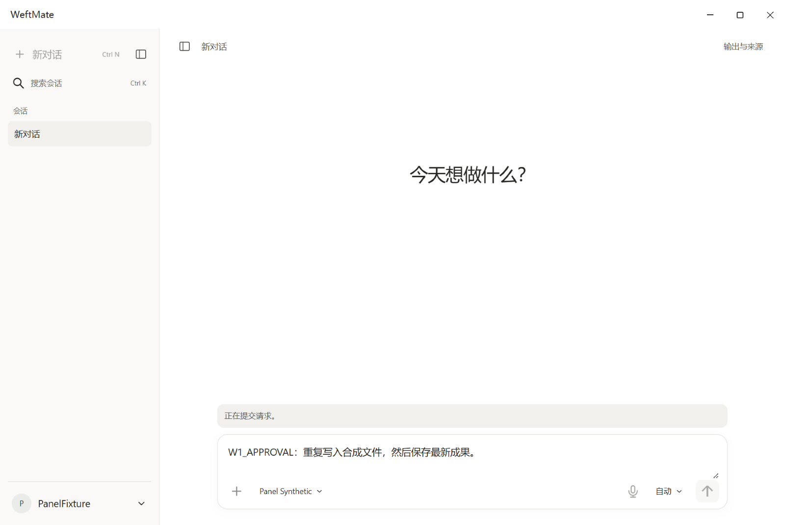
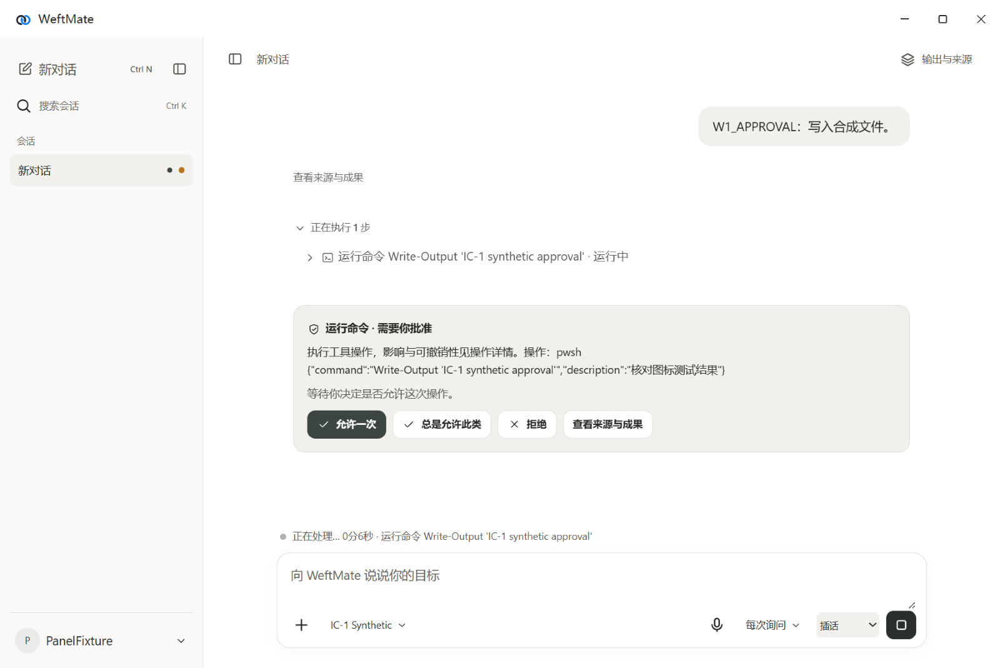
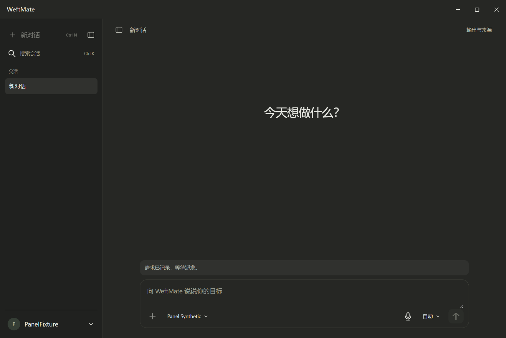
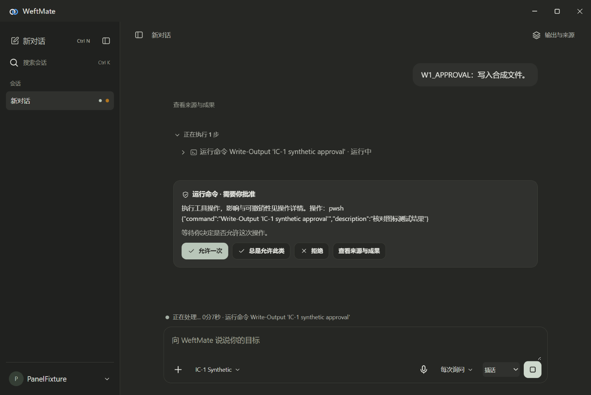

# IC-1 图标系统验收

2026-10-08，Windows Electron（桌面程序框架）和 MuMu Android（安卓）模拟器。全部使用隔离数据、合成身份和本机合成模型，付费模型请求为零。

## 桌面程序

`tests/integration/ic-1-icons-electron.mjs` 使用 Playwright `_electron.launch`（真实程序启动）和固定 DSH（执行框架），通过正常账号登录、模型配置、会话和审批接口生成时间线。系统窗口捕获包含原生标题栏；没有使用浏览器页面替代程序验收。

| 改动前 | 改动后 |
|---|---|
|  |  |
|  |  |

改动前截图在编辑桌面界面前采集，显示提交请求时的侧栏和输入区；改动后显示真实待审批操作。图标重点包括新对话、搜索、侧栏、来源、附件、语音、审批、允许 / 拒绝和停止；任务结束后发送图标恢复，见 [完成态](after-completed.png)。完整的图形规则见 [母版说明](../../../design/icons/README.md)。

Windows 窗口 / 任务栏使用透明底单色 ICO（Windows 图标容器），安装器 / 快捷方式使用彩色 C4；两者均含 16–256 像素。托盘浅 / 深任务栏各一张单色资产，右环与中心点保留 55% 透明度；选择使用 `nativeTheme.shouldUseDarkColorsForSystemIntegratedUI`，与应用主题独立，参见 [Electron 官方文档](https://www.electronjs.org/docs/latest/api/native-theme)。本机托盘处于系统溢出区，`getBounds` 的捕获是展开箭头，没有将其当作新托盘图标证据；任务栏 / 托盘的系统可见截图未取得。通知使用新 C4 资产，程序测试实际触发了审批及结束通知。

## MuMu 模拟器

原有 `com.memoweft.weftmate.mobile.debug` 等安装保持。用临时 Gradle（安卓构建工具）初始化脚本和独立清单覆盖，构建本工作包专属 `com.memoweft.weftmate.mobile.ic1qa` / `.ic1qa.test`，标签为 `WeftMate IC-1 QA`；两个 APK（安卓安装包）在截图后均已卸载，并核对专属包名不再存在。

- [真实桌面上的应用图标](android-launcher.png)：左下角新安装的 C4，其余现有应用未改动。
- [应用内浅色](android/android-chat-light.png)、[深色](android/android-chat-dark.png)。
- [浅色侧栏](android/android-sidebar-light.png)、[深色侧栏](android/android-sidebar-dark.png)。
- [真实系统通知](android/android-notification.png)：合成离线身份产生的同步通知，显示 C4 通知小图标。
- Android 真实资源渲染：[自适应图标](android/android-launcher-render.png)、[单色主题图标](android/android-themed-render.png)、[通知小图标](android/android-notification-render.png)。这些是平台 Drawable（原生绘图资源）的栅格化补充证据，不能替代上述桌面和通知截图。

`IconSystemVisualTest` 仅允许专属 `.ic1qa` 包运行；以离线合成身份进入实际内置 WebView（网页视图），检查浅 / 深界面并截图，通过产品通知实现生成通知、核对小图标资源；没有真实登录、模型推理或用户资料。安装时先检查已有包与前台应用；取证期间仅操作专属测试包和系统桌面 / 通知面板。

## 验证结果

- 新资产与静态路由测试 3/3：45 个确认图标及扩展可继承颜色，生成资产与母版一致；C4 遮罩 / Android 奇偶裁剪与透明度保留；三种 ICO 的尺寸和 PNG（位图）条目完整；新增静态资源可在登录前按正确 MIME（媒体类型）和原安全头读取。
- 最终桌面相关交互 / IPC（进程间通信）69/69，记忆页面夹具回归3/3；桌面界面 3/3 的真实 Chromium（浏览器引擎）交互检查通过；真实 Electron 图标与审批流程通过，报告见 [verification.json](verification.json)。
- 最终手机交互、浅 / 深布局及手机发布回归 97/97。
- Android JVM（Java 虚拟机）27/27，普通 `assembleDebug`、专属 `assembleDebugAndroidTest` 均通过；MuMu 从全新安装运行 `IconSystemVisualTest` 1/1，通过后卸载。
- `npm run typecheck` 和 `git diff --check` 通过；完整测试交 [PR #56 的 GitHub CI（持续集成）](https://github.com/memoweft/weftmate/pull/56/checks)，不在本地跑全量。
- `public account shell keeps secrets out of markup and code-generated HTML` 的既有静态正则失败仍按仓库 CI 例外清单处理：其匹配的 `context` 片段在本包前后完全相同；没有新增或放宽例外。

设计稿原文件的 `file:` 浏览器预览被工具协议安全策略拒绝；母版图形从本人指定 HTML（网页文档）源码精确导入，未修改仓库外设计稿。界面检测器的警告集中在既有动态图片空 `src`、既有页面样式，以及无法从绝对 HTTP（网页访问协议）路径解析本地样式；图标新资产的实际效果以上述程序 / 模拟器截图为准。

Apple（苹果客户端）接入、安装器 / 快捷方式完整安装验收、真实手机与手表显示由后续工作包完成。
