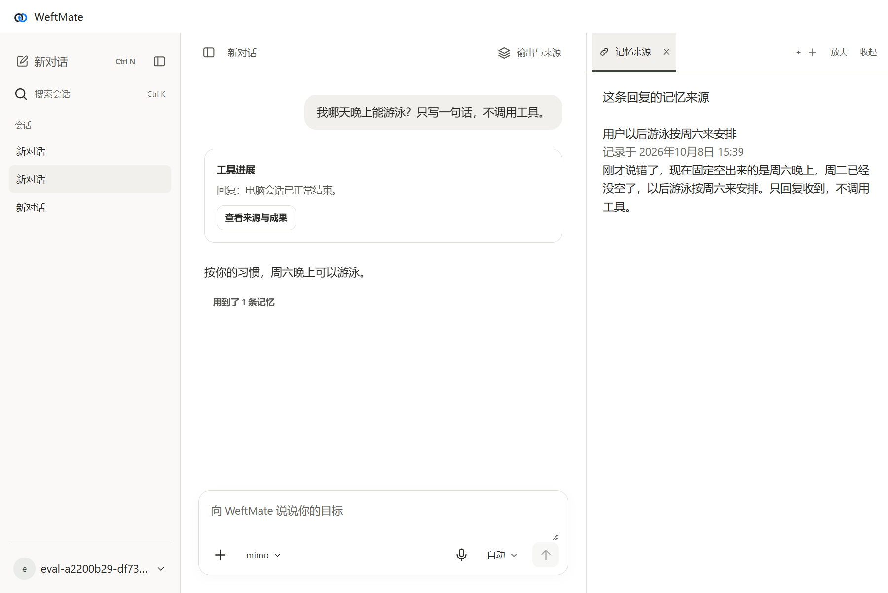
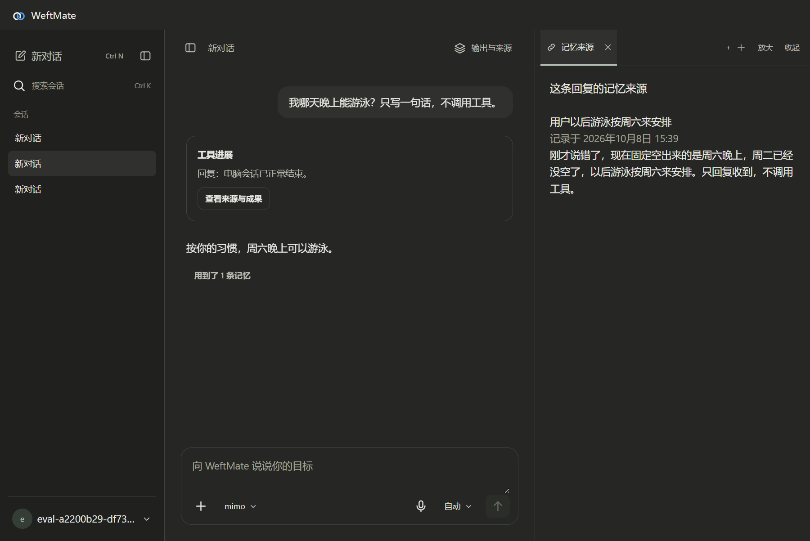

# M2d · 自然纠正与来源

2026-10-08，隔离 Electron（桌面程序框架）个人宿主、固定 DSH（执行框架）、真实 MemoWeft Core（记忆核心）。本地只请求 `http://127.0.0.1:8081/v1` / `qwen3.8-27b-original`；云端只请求官方 MiMo `mimo-v2.6-flash`。合成账号与运行目录在仓库外，密钥仅在进程中引用。

## 真实缺口与修复

修复前 MiMo 的 `memory-02` 已形成 `correct`（纠正），周三旧条目写入 `invalid_at`，来源仍在。但新条目原话为“现在固定空出来的是周五晚上……”时没有“锻炼”，第三轮锻炼问题没有找到它；`memoryUsed`（回复采用的记忆）只有此前的表达偏好，最终推荐周三。错误在召回，不能用“库里已经纠正”代替后续行为验收。

Core [PR #88](https://github.com/memoweft/memoweft/pull/88) 沿已有 `cognition_transitions` 找纠正前的主题。前项只作为检索线索，最终选中和注入的文本／标识都是有效的新条目。每个前项仍检查账号、来源权限、删除、归档和停用；支持连续纠正。普通检索未命中长问题时，从问题与短前项共有的非通用原文字词定位，不生成新事实、不调用模型、不加另一份存储。当前偏好问题排除已取代值；显式历史问题与“某人是谁”的既有身份查询保留“记忆（过往）”行为。

第一版取代链检索仍暴露第二个输入形态：模型只保留“最近只能周三晚上锻炼”这个短前项。原场景文字检查过了，第三轮却只采用表达偏好；重复的桌面演示同样未采用纠正项，来源断言拒绝通过。补上短主题的定向回归后才得到最终周五采用证据。首轮／中途结果完整保留在 [verification.json](verification.json)，没有用最终结果覆盖。

WeftMate [PR #61](https://github.com/memoweft/weftmate/pull/61) 继续通过既有真人回合边界交给 Core；模型提示说明 MemoWeft 自动处理偏好与自然纠正，避免模型仅为记住而另写工作区备忘文件。没有限制用户明确要求的文件任务，也没有修改审批模式。

## 验证

续做相关测试 **16/16**：调度与回合边界保留 11/11，真实 Core 纠正三种输入 3/3，真实健康与待交付队列生命周期 2/2。覆盖时间改口、咖啡否定与偏好演进、旧来源保留、新会话只用新理解、采用新条目标识、重启后不回退。合成测试只替换模型解释，摄取、编译、原子取代、权限、来源与召回均是实际 Core；不直接写记忆数据库。

Core 定向批次 91/91、短主题／历史演进补验 39/39（有重叠），严格 mypy（Python 类型检查）通过。最新完整 CI（持续集成）**1,728/1,728**、203 模块严格类型检查及其他门禁通过。`npm run typecheck` 通过，WeftMate 完整测试只交 CI，最终检查见两份 PR。

原场景文件未改，目标、检查及 **memory-01 600 秒／memory-02 900 秒**总时限不变；可选 LLM judge（模型评判）未启用。附加程序演示与原场景分开记。

| 场景 | 修复前 Qwen / MiMo | 最终 Qwen / MiMo |
|---|---|---|
| memory-01 表达偏好 | 超时 600.63s / 通过 68.94s | **超时 600.63s，首轮无回复** / **通过 79.09s** |
| memory-02 自然纠正 | 超时 900.59s / 失败 114.25s，第三轮未采用周五 | **超时 900.66s，首轮无回复** / **通过 76.69s，第三轮采用周五纠正项** |

续做使用新的独立账号，仅运行两个未改动的原场景：MiMo 2/2，第三轮 `memoryUsed` 标识与数据库有效周五条目一致、排除旧周三条目；已核对已有取代链、旧条目失效时间和双方原话来源。详见 `verification.json` 的 `final-mimo-isolated`。此前最终原场景也通过 60.87s / 144.80s，完整保留；后面的游泳演示会继续改变同一账号的空闲时间，因此采用上述独立复跑作最终原场景核对。

中途 MiMo 为 61.81s / 99.56s，原检查过；独立的纠正条目采用断言未过，不能算 M2d 通过。追加开放式游泳演示触发模型长工具链，604.61s 时主动停止隔离宿主；这是追加演示的取消，不是更改原场景时限。其调用、用量与失败也保留。

真实程序采用新的独立合成账号，**三段独立对话 39.24s 通过**：周二游泳偏好 → 新对话纠正周六 → 再开新对话提问。演示消息明确要求简短答复、不调用工具；原 memory-01/02 没加这些要求。第三轮回答“周六晚上可以游泳”；“用到了 1 条记忆”只指向有效的新说法，来源展示纠正原话。旧周二理解标记失效，旧、新原话都可查；浅／深色来源均通过，审批数 0。





M1-1d 后本次修复前与最终原场景均未观测到未声明审批；没有自动放行任何审批。Qwen 超时轮次仍如实记为运行中／未完成，不把“零审批”当作第三轮完成证明。

## 复跑与边界

```powershell
# 续做最终两个原场景，独立账号，不追加演示：
node tests/integration/personal-scenario-baseline.mjs --memory-loop --only memory-01-preference,memory-02-correction --memory-core-source D:/AIProjects/MemoWeft/Worktrees/m2d-correction/py/src
node tests/integration/personal-scenario-baseline.mjs --memory-loop --only memory-01-preference,memory-02-correction --mimo --mimo-machine --memory-core-source D:/AIProjects/MemoWeft/Worktrees/m2d-correction/py/src
# 原场景后追加独立对话来源验收：
node tests/integration/personal-scenario-baseline.mjs --memory-loop --memory-correction --memory-core-source D:/AIProjects/MemoWeft/Worktrees/m2d-correction/py/src
node tests/integration/personal-scenario-baseline.mjs --memory-loop --memory-correction --mimo --mimo-machine --memory-core-source D:/AIProjects/MemoWeft/Worktrees/m2d-correction/py/src
# 只验三段独立对话的程序来源：
node tests/integration/personal-scenario-baseline.mjs --memory-loop --memory-correction --desktop-only --mimo --mimo-machine --memory-core-source D:/AIProjects/MemoWeft/Worktrees/m2d-correction/py/src
```

Core 主工作目录仍是 `main`，修改位于独立工作树。**Core 只能由 Claude squash（压缩合并）**；本仓 CI 暂时固定公开候选 `561eb090eb009ce07d16b00fc441eeb6cd808c8b`，合并 Core 后须更新为实际 squash 提交。客户端契约无变更。D16 的真正遗忘、完整八步记忆出口与长时间稳定性另包。

本包所有 MiMo 已返回用量的 **110 个请求**：输入 1,203,373 token（令牌），其中缓存 973,312、未缓存 230,061；输出 45,112。已知用量费用 **¥0.33975124（约 ¥0.34，下界）**。共开始 111 个请求；追加演示取消前最后一个请求未返回用量，该笔费用未知，未算入此下界。按[官方价目](https://mimo.mi.com/models/zh-CN/mimo-v2.6-flash)缓存输入 ¥0.02、未缓存输入 ¥1、输出 ¥2／百万 token 计算；已知统计包含首轮诊断、中途失败、追加演示和续做独立复跑，不是账户账单。

最终 Qwen 的两个原场景 **0/2**：各在完整 600／900 秒预算结束，首轮仍运行，无可见回复、无形成结果和纠正行为证据。5 个前台请求没有一个完成；其中一次等待 248.13 秒后收到 HTTP（网络请求）200 与流式保活，但在 300 秒请求期限内仍无回复内容。采样始终为指定 Qwen、98,304／单槽，活动与排队租约各 1。现有证据只能确认本地服务排队／响应超时，不能将未得到回复归因为记忆代码或模型纠正能力。原回合取消后隔离宿主退出；没有停止或重启共享模型服务。上次中断的 Qwen 仅有 memory-01 的完整 600.60 秒失败记录；memory-02 在执行中被停止，保留为 `interrupted-qwen`，不算一次完成的纠正场景。

所有公开证据只有合成事实检查、时刻、用量及数量，不含完整模型回复、真实账号、凭据或临时路径。未读日用保管库、未自起模型、未停止或重启 8080；结束保留 8081 模型。

续做清理：现存 7 个本包相关隔离根，共扫描 1161 个实际文件，密钥命中 **0**，测试凭据文件剩余 **0**，本包隔离宿主／其已登记子进程剩余 **0**；符号链接跳过。此前取消的 MiMo 追加演示自身扫描为 183 文件、0 命中，记录仍保留。公开证据另行扫描 0 命中。8081 保留指定模型；收尾时共享服务活动／排队租约各 1，不替其他并行包关闭服务。
